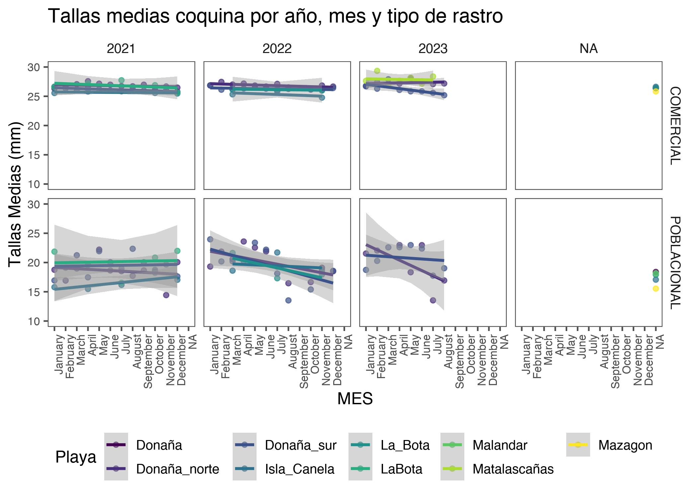
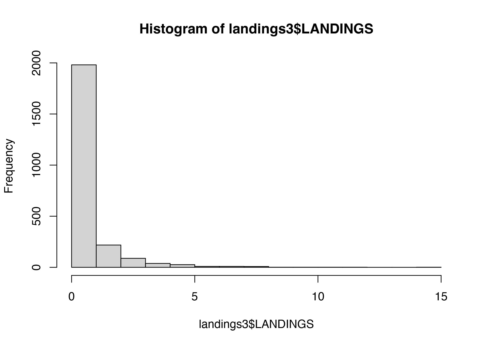
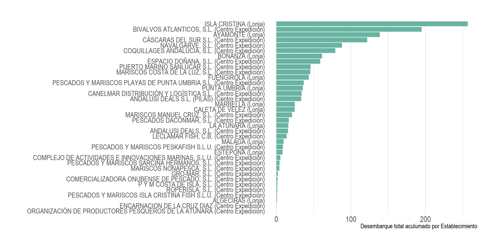

```r
rm(list = ls())
knitr::opts_chunk$set(echo = TRUE,
                      message = FALSE,
                      warning = FALSE,
                      fig.align = 'center',
                      dev = 'jpeg',
                      dpi = 300, 
                      fig.align='center')
#XQuartz is a mess, put this in your onload to default to cairo instead
options(bitmapType = "cairo") 
# (https://github.com/tidyverse/ggplot2/issues/2655)
# Lo mapas se hacen mas rapido
```


```r
library(tidyverse)
library(ggridges)
library(readxl)
library(here)
library(lubridate)
library(readr)
library(ggthemes)
library(hrbrthemes)
library(viridis)
library(kableExtra)
library(ggalt)
library(rnaturalearth)
library(sf)
```


# OBJETIVO

The following document and code intends to carry out a complementary
methodological Exploratory Data Analysis from survey data in coquina
(*Donux truculus*) in a historic context review of FEMP_AND_04 project.

In this case, we analysed biological component like lengths structure,
density indicator and fishery yield in CPUE type.

This analysis are essential to give advice to Junta de Andaluacía
through management plan to D. trunculus [@BOJA2023].

# AREA DE ESTUDIO

La zona de distribución de la coquina objeto de este análisis es en base
a la aplicación de la regulación marisquera española, relacionado con la
producción. Para ello, el litoral andaluz se dividió en diferentes
**zonas de producción** (ZZPP) las cuales se encuentran definidas en la
Orden de 15 de julio de 1993 (BOJA nº 85 de 5/8/1993).

En esta Orden se declaran las zonas de producción y protección o mejora
de moluscos bivalvos, moluscos gasterópodos, tunicados y equinodermos
marinos de la Comunidad Autónoma de Andalucía, fuera de las cuales
quedará prohibida la su recolección. Esta norma delimita zonas de
producción de moluscos bivalvos a lo largo del litoral andaluz en los
cuales se encuentran los puntos de muestreo establecidos en el
seguimiento temporal de *D. trunculus* en el litoral de Huelva llevado a
cabo por el IEO [@Marco2022] (Figura \@ref(fig:map1)).

<div class="figure" style="text-align: center">

<p class="caption">(\#fig:map1)Mapa con los puntos de muestreo establecidos en el seguimiento temporal de D. trunculus en el litoral de Huelva llevado a cabo por el IEO.</p>
</div>

# ENFOQUE DE AED

These data, spetially length frecuencies, must be weighted to the
sampling estimates, because they are just a subsample. This approach has
a logic used to `POBLACIONAL` (Figura \@ref(fig:edaplot1)) and
`COMERCIAL` samples (Figura \@ref(fig:edaplot2));

<div class="figure" style="text-align: center">

<p class="caption">(\#fig:edaplot1)Poblacional sample scheme</p>
</div>

<div class="figure" style="text-align: center">

<p class="caption">(\#fig:edaplot2)Comercial sample scheme</p>
</div>

En este codigo autocontenido, analizaremos tres componentes de interés.
Estructuras de tallas, densidades poblacionales e Indice de
reclutamiento.

# BASES DATOS

En este trabajo se deben revisar todos los componentes que se tienen en cuenta, para ello, investigadores del IEO prepararon una descripción de cada fuente , caracteristicas y su escala temporal. La mayoría de estos dsatos son compuestos por el monitoreo y seguimiento científico de **Donax trunculus** en el Golfo de Cádiz lque lleva a cabo el IEO y AGAPA.


| Item | Periodo | Observación | Agregación  |
|:-------:|:------:|:-----------:|:---------:|
| DESEMBARQUE | 2020-2022 | kg/mariscador o barco/mes | Por playa |
| ESTRUCTURA TALLAS | 2017-2023 | Datos previos al 2020 deben ser revisados | Por playa, por tipo de rastro |
| vB Linf | | 46 mm | Revisar |
| M | | M=2k | Revisar | 
| vB k || 0.48 | Revisar | 
| EDAD MÁXIMA | | EM= log(0.01)/M | Revisar | 
| Parámetros gravimetricos | | a;b |  Revisar | 
| DENSIDAD | 2017-2023 | g/m2/  | Mes, Playa, Rastro |
| RENDIMIENTO (CPUE) | 2018-2023 | 3 horas/mariscador/dia. (180min*peso coquina>25mm*5min) | Por Mes, playa, rastro |
| INDICE RECLUTAMIENTO (D15) | 2017-2022 | ind/m2 < 15mm | Por Mes, playa, rastro |
| TALLA PRIMERA MADUREZ |  | L50=10.8mm | L95= pendiente |


En cuanto a aspectos reproductivos, la reproducción de coquina es entre los meses de Febrero – julio, con un maximo de desove entre mayo- julio, coincidiendo con la veda [@BOJA2023].

## Leer y juntar Data Base {.tabset .tabset-pills}

### Bases de Longitudes 


```r
# Datos 2020 size and dens and abundance join
size2017 <- read.csv2(here("Data", 
                           "Anterior a 2020", 
                           "data_ieo_2017_def.csv"),
                      dec=".")
size2018 <- read.csv2(here("Data", 
                           "Anterior a 2020", 
                           "data_ieo_2018_def.csv"), 
                      dec=".")
size2019 <- read.csv2(here("Data", 
                           "Anterior a 2020",
                           "data_ieo_2019_def.csv"), 
                      dec=".")
size2020 <- read.csv2(here("Data", 
                           "Anterior a 2020", 
                           "data_ieo_2020_def.csv"), 
                      dec=".")
# datos post 2020 separate files sizes and dens
# Lenght 
size2021 <- read_excel(here("Data", 
                            "Posterior 2020", 
                            "Data_size_Coquina_2021.xlsx"), 
                       sheet = "Coquina_donax")
size2022 <- read_excel(here("Data",
                            "Posterior 2020", 
                            "Data_size_Coquina_2022.xlsx"),  
                       sheet = "Coquina_donax")
size2023 <- read_excel(here("Data", 
                            "Posterior 2020",
                            "Data_size_Coquina_2023.xlsx"),  
                       sheet = "Coquina_Donax")
```


# COMPOSICIONES DE TALLAS

Este aspecto se trabaja de forma de ponderación ad-hoc descrita en la
Figure \@ref(fig:edaplot1)

## Test dimension and names columns and diferences


```r
dim(size2017)
```

```
## [1] 10121    28
```

```r
dim(size2018)
```

```
## [1] 20418    28
```

```r
dim(size2019)       
```

```
## [1] 18109    28
```

```r
dim(size2020)
```

```
## [1] 13435    28
```

```r
dim(size2021)
```

```
## [1] 21971    12
```


```r
names(size2017)
```

```
##  [1] "months"                      "Date"                       
##  [3] "Beach"                       "Sampling.point"             
##  [5] "track_activelog"             "lat_1"                      
##  [7] "long_1"                      "lat_2"                      
##  [9] "long_2"                      "plus_m"                     
## [11] "tow_time"                    "rastro"                     
## [13] "zaranda"                     "mariscador"                 
## [15] "sample"                      "Sample_weight"              
## [17] "Clam_sample_weigth"          "Measured_clam_sample_weigth"
## [19] "CAT"                         "Categoria"                  
## [21] "Size"                        "SizeE"                      
## [23] "Tide_coef"                   "Low_tide_hour"              
## [25] "Sampling_hour"               "number_fisherman"           
## [27] "veda"                        "dists"
```

```r
names(size2018)
```

```
##  [1] "months"                      "Date"                       
##  [3] "Beach"                       "Sampling.point"             
##  [5] "track_activelog"             "lat_1"                      
##  [7] "long_1"                      "lat_2"                      
##  [9] "long_2"                      "plus_m"                     
## [11] "tow_time"                    "rastro"                     
## [13] "zaranda"                     "mariscador"                 
## [15] "sample"                      "Sample_weight"              
## [17] "Clam_sample_weigth"          "Measured_clam_sample_weigth"
## [19] "CAT"                         "Categoria"                  
## [21] "Size"                        "SizeE"                      
## [23] "Tide_coef"                   "Low_tide_hour"              
## [25] "Sampling_hour"               "number_fisherman"           
## [27] "veda"                        "dists"
```

```r
names(size2019)
```

```
##  [1] "months"                      "Date"                       
##  [3] "Beach"                       "Sampling.point"             
##  [5] "track_activelog"             "lat_1"                      
##  [7] "long_1"                      "lat_2"                      
##  [9] "long_2"                      "plus_m"                     
## [11] "tow_time"                    "rastro"                     
## [13] "zaranda"                     "mariscador"                 
## [15] "sample"                      "Sample_weight"              
## [17] "Clam_sample_weigth"          "Measured_clam_sample_weigth"
## [19] "CAT"                         "Categoria"                  
## [21] "Size"                        "SizeE"                      
## [23] "Tide_coef"                   "Low_tide_hour"              
## [25] "Sampling_hour"               "number_fisherman"           
## [27] "veda"                        "dists"
```

```r
names(size2020)
```

```
##  [1] "months"                      "Date"                       
##  [3] "Beach"                       "Sampling.point"             
##  [5] "track_activelog"             "lat_1"                      
##  [7] "long_1"                      "lat_2"                      
##  [9] "long_2"                      "plus_m"                     
## [11] "tow_time"                    "rastro"                     
## [13] "zaranda"                     "mariscador"                 
## [15] "sample"                      "Sample_weight"              
## [17] "Clam_sample_weigth"          "Measured_clam_sample_weigth"
## [19] "CAT"                         "Categoria"                  
## [21] "Size"                        "SizeE"                      
## [23] "Tide_coef"                   "Low_tide_hour"              
## [25] "Sampling_hour"               "number_fisherman"           
## [27] "veda"                        "dists"
```

```r
names(size2021)
```

```
##  [1] "species"                "Date"                   "Beach"                 
##  [4] "Sampling.point"         "rastro"                 "CAT"                   
##  [7] "Categoria"              "size"                   "sizeE"                 
## [10] "ID"                     "ID_codificado_punto"    "ID_codificado_muestreo"
```

Same names. Could merge the DF


```r
size_17_20 <- rbind(size2017,
                    size2018,
                    size2019,
                    size2020)
```


```r
# new dimension
dim(size_17_20)
```

```
## [1] 62083    28
```

```r
glimpse(size_17_20)
```

```
## Rows: 62,083
## Columns: 28
## $ months                      <int> 7, 7, 7, 7, 7, 7, 7, 7, 7, 7, 7, 7, 7, 7, …
## $ Date                        <chr> "13/07/2017", "13/07/2017", "13/07/2017", …
## $ Beach                       <chr> "Donana", "Donana", "Donana", "Donana", "D…
## $ Sampling.point              <chr> "2", "2", "2", "2", "2", "2", "2", "2", "2…
## $ track_activelog             <dbl> NA, NA, NA, NA, NA, NA, NA, NA, NA, NA, NA…
## $ lat_1                       <dbl> NA, NA, NA, NA, NA, NA, NA, NA, NA, NA, NA…
## $ long_1                      <dbl> NA, NA, NA, NA, NA, NA, NA, NA, NA, NA, NA…
## $ lat_2                       <dbl> NA, NA, NA, NA, NA, NA, NA, NA, NA, NA, NA…
## $ long_2                      <dbl> NA, NA, NA, NA, NA, NA, NA, NA, NA, NA, NA…
## $ plus_m                      <int> NA, NA, NA, NA, NA, NA, NA, NA, NA, NA, NA…
## $ tow_time                    <dbl> 5, 5, 5, 5, 5, 5, 5, 5, 5, 5, 5, 5, 5, 5, …
## $ rastro                      <chr> "COMERCIAL", "COMERCIAL", "COMERCIAL", "CO…
## $ zaranda                     <chr> "R", "R", "R", "R", "R", "R", "R", "R", "R…
## $ mariscador                  <chr> "LUIS", "LUIS", "LUIS", "LUIS", "LUIS", "L…
## $ sample                      <chr> "13/07/2017", "13/07/2017", "13/07/2017", …
## $ Sample_weight               <dbl> NA, NA, NA, NA, NA, NA, NA, NA, NA, NA, NA…
## $ Clam_sample_weigth          <dbl> 195, 195, 195, 195, 195, 195, 195, 195, 19…
## $ Measured_clam_sample_weigth <dbl> 195, 195, 195, 195, 195, 195, 195, 195, 19…
## $ CAT                         <int> 1, 1, 1, 1, 1, 1, 1, 1, 1, 1, 1, 1, 1, 1, …
## $ Categoria                   <chr> "", "", "", "", "", "", "", "", "", "", ""…
## $ Size                        <dbl> 27.21, 26.65, 26.65, 25.07, 27.49, 26.15, …
## $ SizeE                       <int> 27, 26, 26, 25, 27, 26, 26, 28, 25, 28, 26…
## $ Tide_coef                   <int> 72, 72, 72, 72, 72, 72, 72, 72, 72, 72, 72…
## $ Low_tide_hour               <chr> "12:30 AM", "12:30 AM", "12:30 AM", "12:30…
## $ Sampling_hour               <chr> "", "", "", "", "", "", "", "", "", "", ""…
## $ number_fisherman            <lgl> NA, NA, NA, NA, NA, NA, NA, NA, NA, NA, NA…
## $ veda                        <lgl> NA, NA, NA, NA, NA, NA, NA, NA, NA, NA, NA…
## $ dists                       <lgl> NA, NA, NA, NA, NA, NA, NA, NA, NA, NA, NA…
```

## Change `Date` columns from `character`to `Date` format


```r
size_17_20$Date <- dmy(size_17_20$Date)
# separo los meses , dias y años
# Separar en columnas de día, mes y año
realdate <- as.Date(size_17_20$Date, format="%Y-%M-%D")

dfdate <- data.frame(Date=realdate)
ANO=as.numeric (format(realdate,"%Y"))
MES=as.numeric (format(realdate,"%m"))
DIA=as.numeric (format(realdate,"%d"))

size2<-cbind(dfdate,ANO,MES,DIA,size_17_20)
head(size2)
```

```
##         Date  ANO MES DIA months       Date  Beach Sampling.point
## 1 2017-07-13 2017   7  13      7 2017-07-13 Donana              2
## 2 2017-07-13 2017   7  13      7 2017-07-13 Donana              2
## 3 2017-07-13 2017   7  13      7 2017-07-13 Donana              2
## 4 2017-07-13 2017   7  13      7 2017-07-13 Donana              2
## 5 2017-07-13 2017   7  13      7 2017-07-13 Donana              2
## 6 2017-07-13 2017   7  13      7 2017-07-13 Donana              2
##   track_activelog lat_1 long_1 lat_2 long_2 plus_m tow_time    rastro zaranda
## 1              NA    NA     NA    NA     NA     NA        5 COMERCIAL       R
## 2              NA    NA     NA    NA     NA     NA        5 COMERCIAL       R
## 3              NA    NA     NA    NA     NA     NA        5 COMERCIAL       R
## 4              NA    NA     NA    NA     NA     NA        5 COMERCIAL       R
## 5              NA    NA     NA    NA     NA     NA        5 COMERCIAL       R
## 6              NA    NA     NA    NA     NA     NA        5 COMERCIAL       R
##   mariscador     sample Sample_weight Clam_sample_weigth
## 1       LUIS 13/07/2017            NA                195
## 2       LUIS 13/07/2017            NA                195
## 3       LUIS 13/07/2017            NA                195
## 4       LUIS 13/07/2017            NA                195
## 5       LUIS 13/07/2017            NA                195
## 6       LUIS 13/07/2017            NA                195
##   Measured_clam_sample_weigth CAT Categoria  Size SizeE Tide_coef Low_tide_hour
## 1                         195   1           27.21    27        72      12:30 AM
## 2                         195   1           26.65    26        72      12:30 AM
## 3                         195   1           26.65    26        72      12:30 AM
## 4                         195   1           25.07    25        72      12:30 AM
## 5                         195   1           27.49    27        72      12:30 AM
## 6                         195   1           26.15    26        72      12:30 AM
##   Sampling_hour number_fisherman veda dists
## 1                             NA   NA    NA
## 2                             NA   NA    NA
## 3                             NA   NA    NA
## 4                             NA   NA    NA
## 5                             NA   NA    NA
## 6                             NA   NA    NA
```

```r
table(size2$MES)
```

```
## 
##    1    2    3    4    5    6    7    8    9   10   11   12 
## 4190 3300 5020 1833 2278 7201 5718 6291 9648 5640 4477 6487
```

```r
table(size2$months)
```

```
## 
##     1     2     3     4     5     6     7     8     9    10    11    12 
##  4190  3300  5020  1833  2278  7201  5718  6291 10812  4476  4477  6487
```

Now we test.


```r
table(size2$ANO)
```

```
## 
##  2017  2018  2019  2020 
## 10121 20418 18109 13435
```

### Viz

Primera vizulación de las tallas de coquina diferenciasdas por tipo de
muestreo. Línea roja es SL50 (10.8 mm para hembras [@Delgado2017] y
línea amarilla es la talla mínima de extracción legal en 25 mm.
[@Delgado2018].


```r
nreg <- ggplot(size2 %>% 
                 select(-1), 
               aes(x=Size, 
                   y = as.factor(MES),
                  fill= as.factor(rastro)))+
  geom_density_ridges(stat = "binline", 
                      bins = 40, 
                      scale = 1.2,
                      alpha=0.7)+
  facet_wrap(.~ANO, ncol=4) +
  geom_vline(xintercept = 10.8, color = "red")+
  geom_vline(xintercept = 25, color = "yellow")+
  scale_fill_manual(values = c("#636363", 
                               "#2c7fb8", 
                               "#de2d26", 
                               "#756bb1", 
                               "#2ca25f"),
                       name="Rastro")+
  theme(axis.text.x = element_text(angle = 90, hjust = 1))+
  theme_few()+
  xlab("Longitud (cm.)")+
  ylab("")+
  xlim(0,40)
#scale_x_discrete((limits = rev(levels(talla2021$ANO_ARR))))+
nreg
```


by beach


```r
nbeach <- ggplot(size2 %>% 
                 select(-1), 
               aes(x=SizeE, 
                   y = as.factor(MES),
                  fill= as.factor(Beach)))+
  geom_density_ridges(stat = "binline", 
                      bins = 40, 
                      scale = 1.2,
                      alpha=0.7)+
  facet_wrap(.~ANO, ncol=4) +
  geom_vline(xintercept = 10.8, color = "red")+
  scale_fill_viridis_d(option="F",
                       name="Beach")+
  theme(axis.text.x = element_text(angle = 90, hjust = 1))+
  theme_few()+
  xlab("Longitud (cm.)")+
  ylab("")+
  xlim(0,40)
#scale_x_discrete((limits = rev(levels(talla2021$ANO_ARR))))+
nbeach
```


Now, we handling data 2021-2023. Same columns data 2017-2020


```r
size2021b <- size2021 %>% 
  select(2, 3, 4, 5, 6, 7, 8, 9, 12)
names(size2021b)
```

```
## [1] "Date"                   "Beach"                  "Sampling.point"        
## [4] "rastro"                 "CAT"                    "Categoria"             
## [7] "size"                   "sizeE"                  "ID_codificado_muestreo"
```

```r
size2022b <- size2022 %>% 
  select(-c(1, 2))
size2023b <- size2023 %>% 
  select(-c(1, 2))

size_21_23 <- rbind(size2021b,
                    size2022b,
                    size2023b)
```

### Separate `Date` column


```r
size_21_23$Date <- ymd(size_21_23$Date)
# separo los meses , dias y años
# Separar en columnas de día, mes y año
realdate <- as.Date(size_21_23$Date, format="%Y-%M-%D")
dfdate <- data.frame(Date=realdate)
ANO=as.numeric (format(realdate,"%Y"))
MES=as.numeric (format(realdate,"%m"))
DIA=as.numeric (format(realdate,"%d"))
size3<-cbind(dfdate,ANO,MES,DIA,size_21_23)
 colnames(size3)
```

```
##  [1] "Date"                   "ANO"                    "MES"                   
##  [4] "DIA"                    "Date"                   "Beach"                 
##  [7] "Sampling.point"         "rastro"                 "CAT"                   
## [10] "Categoria"              "size"                   "sizeE"                 
## [13] "ID_codificado_muestreo"
```

```r
table(size3$ANO, size3$MES)
```

```
##       
##           1    2    3    4    5    6    7    8    9   10   11   12
##   2021 3103 1600  897 2399  784 1384 2846  819 1384 2389 1552 2814
##   2022 1374 1156 2560 1673 1013 1857 2577  868    0  996 2619  733
##   2023  915 1040  866  857  732 1068  618  655  639  384    0    0
```

Now join all years


```r
names(size2) # 2017-2020
```

```
##  [1] "Date"                        "ANO"                        
##  [3] "MES"                         "DIA"                        
##  [5] "months"                      "Date"                       
##  [7] "Beach"                       "Sampling.point"             
##  [9] "track_activelog"             "lat_1"                      
## [11] "long_1"                      "lat_2"                      
## [13] "long_2"                      "plus_m"                     
## [15] "tow_time"                    "rastro"                     
## [17] "zaranda"                     "mariscador"                 
## [19] "sample"                      "Sample_weight"              
## [21] "Clam_sample_weigth"          "Measured_clam_sample_weigth"
## [23] "CAT"                         "Categoria"                  
## [25] "Size"                        "SizeE"                      
## [27] "Tide_coef"                   "Low_tide_hour"              
## [29] "Sampling_hour"               "number_fisherman"           
## [31] "veda"                        "dists"
```

```r
names(size3)# 2021-2023
```

```
##  [1] "Date"                   "ANO"                    "MES"                   
##  [4] "DIA"                    "Date"                   "Beach"                 
##  [7] "Sampling.point"         "rastro"                 "CAT"                   
## [10] "Categoria"              "size"                   "sizeE"                 
## [13] "ID_codificado_muestreo"
```

```r
size2fil <- size2 %>% 
  select(1, 2, 3, 4, 7, 8, 16, 23, 24, 25, 26)
size3fil <- size3 %>% 
  select(-c(13,5)) %>% 
  rename(Size = size,
         SizeE = sizeE)
names(size2fil) # 2017-2020
```

```
##  [1] "Date"           "ANO"            "MES"            "DIA"           
##  [5] "Beach"          "Sampling.point" "rastro"         "CAT"           
##  [9] "Categoria"      "Size"           "SizeE"
```

```r
names(size3fil)# 2021-2023
```

```
##  [1] "Date"           "ANO"            "MES"            "DIA"           
##  [5] "Beach"          "Sampling.point" "rastro"         "CAT"           
##  [9] "Categoria"      "Size"           "SizeE"
```

```r
# join data
sizeall <- rbind(size2fil, size3fil)
```

check


```r
dim(sizeall)
```

```
## [1] 109254     11
```

```r
table(sizeall$ANO)
```

```
## 
##  2017  2018  2019  2020  2021  2022  2023 
## 10121 20418 18109 13435 21971 17426  7774
```

Rename values


```r
sizeall2 <- sizeall %>% 
  mutate(rastro = str_replace_all(rastro, " ", ""),
         rastro = str_replace_all(rastro, "COMERCIALNEW", "COMERCIAL"),
         Beach = str_replace_all(Beach, "Donana", "Donaña"),
         Beach = str_replace_all(Beach, " ", ""),
         Beach = str_replace_all(Beach, "Matalascanas", "Matalascañas")) %>% 
  mutate(MES = case_when(
    MES == 1 ~ "January",
    MES == 2 ~ "February",
    MES == 3 ~ "March",
    MES == 4 ~ "April",
    MES == 5 ~ "May",
    MES == 6 ~ "June",
    MES == 7 ~ "July",
    MES == 8 ~ "August",
    MES == 9 ~ "September",
    MES == 10 ~ "October",
    MES == 11 ~ "November",
    MES == 12 ~ "December")) %>% 
  mutate(MES = factor(MES, levels = c("January", 
                                          "February", 
                                          "March",
                                          "April",
                                          "May",
                                          "June",
                                          "July",
                                          "August",
                                          "September",
                                          "October",
                                          "November", 
                                          "December")))

unique(sizeall2$Beach)
```

```
## [1] "Donaña"       "La_Bota"      "Isla_Canela"  "Mazagon"      "Malandar"    
## [6] "Donaña_sur"   "Donaña_norte" "LaBota"       "Matalascañas"
```

```r
unique(sizeall2$rastro)
```

```
## [1] "COMERCIAL"   "POBLACIONAL"
```

```r
unique(sizeall2$MES)
```

```
##  [1] July      August    September October   November  December  January  
##  [8] February  March     April     May       June     
## 12 Levels: January February March April May June July August ... December
```

some plots


```r
nall <- ggplot(sizeall2, 
               aes(x=Size, 
                   y = as.factor(MES),
                  fill= as.factor(rastro)))+
  geom_density_ridges(stat = "binline", 
                      bins = 50, 
                      scale = 1.2,
                      alpha=0.7)+
  facet_wrap(.~ANO, ncol=7) +
  geom_vline(xintercept = 10.8, color = "red")+
  scale_fill_viridis_d(option="B",
                       name="Rastro")+
  theme(axis.text.x = element_text(angle = 90, hjust = 1))+
  theme_few()+
  theme(legend.position = "bottom")+
  xlab("Longitud (mm.)")+
  ylab("")+
  xlim(0,40)
#scale_x_discrete((limits = rev(levels(talla2021$ANO_ARR))))+
nall
```


La


```r
nallbeach <- ggplot(sizeall2, 
               aes(x=Size, 
                   y = as.factor(MES),
                  fill= as.factor(Beach)))+
  geom_density_ridges(stat = "binline", 
                      bins = 50, 
                      scale = 1.2,
                      alpha=0.7)+
  facet_wrap(.~ANO, ncol=7) +
  geom_vline(xintercept = 10.8, color = "red")+
  scale_fill_viridis_d(option="F",
                       name="Beach")+
  theme(axis.text.x = element_text(angle = 90, hjust = 1))+
  theme_few()+
  theme(legend.position = "bottom")+
  xlab("Longitud (mm.)")+
  ylab("")+
  xlim(0,40)
#scale_x_discrete((limits = rev(levels(talla2021$ANO_ARR))))+
nallbeach
```


just Poblacional sample


```r
pobeach <- ggplot(sizeall2 %>% 
                      filter(rastro!="COMERCIAL"), 
               aes(x=Size, 
                   y = as.factor(MES),
                  fill= as.factor(Beach)))+
  geom_density_ridges(stat = "binline", 
                      bins = 50, 
                      scale = 1.2,
                      alpha=0.7)+
  facet_wrap(.~ANO, ncol=7) +
  geom_vline(xintercept = 10.8, color = "red")+
  scale_fill_viridis_d(option="G",
                       name="Beach")+
  theme(axis.text.x = element_text(angle = 90, hjust = 1))+
  theme_few()+
  theme(legend.position = "bottom")+
  xlab("Longitud (mm.)")+
  ylab("")+
  xlim(0,40)
#scale_x_discrete((limits = rev(levels(talla2021$ANO_ARR))))+
pobeach
```


justm Comercial sample


```r
combeach <- ggplot(sizeall2 %>% 
                      filter(rastro!="POBLACIONAL"), # saco poblacional
               aes(x=Size, 
                   y = as.factor(MES),
                  fill= as.factor(Beach)))+
  geom_density_ridges(stat = "binline", 
                      bins = 50, 
                      scale = 1.2,
                      alpha=0.7)+
  facet_wrap(.~ANO, ncol=7) +
  geom_vline(xintercept = 10.8, color = "red")+
  scale_fill_viridis_d(option="F",
                       name="Beach")+
  theme(axis.text.x = element_text(angle = 90, hjust = 1))+
  theme_few()+
  theme(legend.position = "bottom")+
  xlab("Longitud (mm.)")+
  ylab("")+
  xlim(0,40)
#scale_x_discrete((limits = rev(levels(talla2021$ANO_ARR))))+
combeach
```


last month of 2023 (august) by beach


```r
combeachago23 <- ggplot(sizeall2 %>% 
                      filter(ANO==2023), 
               aes(x=Size, y=Beach, fill=as.character(rastro)))+
  geom_density_ridges(stat = "binline", 
                      bins = 40, 
                      scale = 1.2,
                      alpha=0.8)+
  scale_fill_manual(values = c("red", "blue"))+
  facet_wrap(.~MES, ncol=5) +
  geom_vline(xintercept = 10.8, color = "red")+
  theme_few()+
  theme(legend.position = "bottom")+
  xlab("Longitud (cm.)")+
  ylab("")+
  xlim(0,40)+
  labs(title= "Survey 2023")
#scale_x_discrete((limits = rev(levels(talla2021$ANO_ARR))))+
combeachago23
```


another way to viz is

scatter plot


```r
sizemean <-sizeall2 %>% 
  dplyr::group_by(ANO, MES, rastro, Sampling.point) %>%
  dplyr::summarise(avg=mean(SizeE))
#kableExtra::kable(coutlength, format = "html")
```

Mean length in time series by Subarea.


```r
pmea <- ggplot(sizemean %>% 
                 filter(Sampling.point %in% c("2", "4", "6", "M")), 
               aes(MES,avg,
               color=rastro, group=rastro))+
    geom_point(show.legend = T,
               alpha=.7) +
    geom_smooth(method= "lm")+
    theme_few()+ 
    facet_grid(Sampling.point~ANO)+
    #scale_y_discrete(breaks = seq(from = 1, to = 13, by = 1))+
    theme(axis.text.x = element_text(angle = 90,
                                     hjust = 1,
                                     vjust= 0.5,
                                     size = 8),
          axis.text.y = element_text(size = 8),
          legend.position = "bottom")+
    guides(fill = guide_legend(reverse=F))+
    scale_color_viridis_d(option="H",
                          name="Punto")+
    ylim(10,30)+
    ylab("Tallas Medias (mm)") +
    xlab("MES") +
    ggtitle("Tallas medias coquina por año, mes y tipo de rastro")
pmea
```



# INDICE DE RECLUTAMIENTO POBLACIONAL (D15)

### Bases de Densidades

Recordar que las bases de densidades previas al 2021 estan en la misma base que las longitudes


```r
dens2021pob <- read_excel(here("Data", "Posterior 2020", 
                               "Data_sample_FEMP_04_2021.xlsx"),
                       sheet = "Data_POBL")
dens2022pob <- read_excel(here("Data", "Posterior 2020", 
                               "Data_sample_FEMP_04_2022.xlsx"),
                       sheet = "Data_POBL")
dens2023pob <- read_excel(here("Data", "Posterior 2020", 
                               "Data_sample_FEMP_04_2023.xlsx"),
                       sheet = "Data_POBL")
```

Visualizo los datos y su estructura. Para replicar los procesos de calculos en las hojas excel, usaremos solo las columnas con datos crudos. Es decir, desde `Date` hasta `MCSWsub`, y algunas columnas finales. La idea es hacer los cálculos en el codigo para tener la secuencia y replicar los resultados informados por @Delgado2023. 

Primero comenzamos con los datos estandarizados del os años 2021 al 2023. Luego juntamos la data. En ambos muestreos `COMERCIAL`y `POBLACIONAL` dejo las siguientes columas;

- `Date` = Fecha
- `Beach` = Playa
- `Sampling.point` =punto de Muestreo
- `m_track` = distancia de arrastre (mts)
- `tow_time` = tiempo de arrastre (minutos)
- `Latº` 
- `Latmin`                
- `Longº` 
- `Longmin`               
- `Lat`  
- `Long`                  
- `rastro`
- `mariscador`            
- `SW` = Peso total de la muestra ( cascajo, coquina, fauna)  
- `SWsub` = SubMuestra de `SW`                 
- `CSWsub` = Peso coquina contenida en `SWsub`
- `CMSWsub` = Peso de toda la coquina comercial sub (>25 mm) (Columna solo en base `COMERCIAL`)
- `MCSWsub` = Peso de la coquina medida de `CSWsub` real*
- `DCSWsub` = Peso de la coquina con daños en la muestra `SWsub`
- `Categoria` = na
- `CAT` = 2Poblacional, 1 Comercial
- `Nmedida` =   Este dato son los individuos medidos provenientes de  los datos de Tallas. Preguntar a MD*             
- `Ndañossub` =            
- `Tide_coef`  =  Coef de Marea
- `Low_tide_hour` = 
- `Catch_hour`  = Hora de faena
- `species`   = Especie
- `Temp` = TSM
- `ID_codificado_punto` = ID
- `ID_codificado_muestreo` = ID


Filtro las bases


```r
# poblacional
dens2021pobf <- dens2021pob %>% 
  select(2:18, 23, 27:29, 32, 35:39, 44, 45)
dens2022pobf <- dens2022pob %>% 
  select(2:18, 23, 27:29, 32, 35:39, 43, 44) %>% 
  rename(ID_codificado_punto=ID)
dens2023pobf <- dens2023pob %>% 
  select(2:18, 23, 27:29, 32, 35:39, 43, 44) %>% 
  rename(ID_codificado_punto=ID)

#compruebo si hay columnas iguales
nombres_iguales_pob <- identical(names(dens2021pobf),
                             names(dens2023pobf)) && identical(names(dens2021pobf), 
                                                               names(dens2022pobf))
#junto la base
denspob2123f <- rbind(dens2021pobf, dens2022pobf, dens2023pobf)
```


## Separate `Date` column


```r
realdate <- as.Date(denspob2123f$Date, format="%Y-%M-%D")
dfdate <- data.frame(Date=realdate)
ANO=as.numeric (format(realdate,"%Y"))
MES=as.numeric (format(realdate,"%m"))
DIA=as.numeric (format(realdate,"%d"))
denspob2123f<-cbind(ANO,MES,DIA,denspob2123f)
colnames(denspob2123f)
```

```
##  [1] "ANO"                    "MES"                    "DIA"                   
##  [4] "Date"                   "Beach"                  "Sampling.point"        
##  [7] "m_track"                "tow_time"               "Latº"                  
## [10] "Latmin"                 "Longº"                  "Longmin"               
## [13] "Lat"                    "Long"                   "rastro"                
## [16] "mariscador"             "SW"                     "SWsub"                 
## [19] "CSWsub"                 "MCSWsub"                "DCSWsub"               
## [22] "Categoria"              "CAT"                    "Nmedida"               
## [25] "Ndañossub"              "Tide_coef"              "Low_tide_hour"         
## [28] "Catch_hour"             "species"                "Temp"                  
## [31] "ID_codificado_punto"    "ID_codificado_muestreo"
```

```r
table(denspob2123f$ANO)
```

```
## 
## 2021 2022 2023 
##   98   90   59
```


De todas formas, hay una columna que difiere de ambos bases filtradas `COMERCIAL`y `POBLACIONAL`, en este caso `CMSWsub` definida previamente. por lo mismo, no puedo juntar las bases.


Ahora calculamos las siguientes variables para `POBLACIONAL`;

- `fps` =`SW`/ `SWsub`
- `CSW` = `CSWsub` * `fps`
- `fpm` =   `CSW` / `CSWsub` 
- `MCSW` = `MCSWsub`* `fpm` (Peso de coquina medida de `CSW`  Hipotetico)
- `DCSW` =  `DCSWsub` * `fps` (Peso de la coquina con daños en `SW`)
- `TCSW`  = `CSW`+ `DCSW` (peso coquina en `SW` , incluidos daños)
- `Btotal` = `TCSW (g)` + `TCSW (p)` (Grande y pequeña, Usar como referencia el `Sampling.point`)
- `fpn` =   `MCSWsub`/ `CSW`
- `NtotalCSW`  = `Nmedida` * `fpn`
- `Ndaños`= `Ndañossub` * `fps`      
- `Ntotal` = `NtotalCSW (g)`+`NtotalCSW (p)` + `Ndaños` * `fps` (Grande y pequeña, Usar como referencia el `Sampling.point`)
- `area` = `m_track`* 0.445 (preguntar valor!)
- `bio` = `Btotal`* `area`
- `dens` =  `Ntotal` * `area` (ind/m2)


pproceder a los calculos para calcular las variables poblacionales de interes, en este caso Densidad, Abundancia y Biomasa;


```r
denspobtot <- denspob2123f %>% 
  mutate(fps = SW /SWsub,
         CSW = CSWsub * fps,
         fpm = CSW * CSWsub,
         MCSW = MCSWsub * fpm,
         DCSW = DCSWsub * fps,
         TCSW = CSW + DCSW)

denspobtot2 <- denspobtot %>% 
  group_by(Beach, Sampling.point, ANO, MES, DIA) %>% 
  mutate(Btotal=sum(TCSW),
         fpn = MCSWsub/CSW,
         NtotalCSW  = Nmedida * fpn, 
         Ndaños = Ndañossub * fps, 
         Ntotal = sum(NtotalCSW) + Ndaños * fps,
         area = m_track * 0.445,
         bio= Btotal * area,
         dens = Ntotal * area)
tail(denspobtot2)
```

```
## # A tibble: 6 × 46
## # Groups:   Beach, Sampling.point, ANO, MES, DIA [3]
##     ANO   MES   DIA Date                Beach      Sampl…¹ m_track tow_t…²  Latº
##   <dbl> <dbl> <dbl> <dttm>              <chr>        <dbl>   <dbl>   <dbl> <dbl>
## 1  2023    10    16 2023-10-16 00:00:00 Donana_no…       6      65       5    36
## 2  2023    10    16 2023-10-16 00:00:00 Donana_no…       6      65       5    36
## 3  2023    10    16 2023-10-16 00:00:00 Donana_no…       4      73       5    36
## 4  2023    10    16 2023-10-16 00:00:00 Donana_no…       4      73       5    36
## 5  2023    10    16 2023-10-16 00:00:00 Donana_sur       2      50       5    36
## 6  2023    10    16 2023-10-16 00:00:00 Donana_sur       2      50       5    36
## # … with 37 more variables: Latmin <dbl>, Longº <dbl>, Longmin <dbl>,
## #   Lat <dbl>, Long <dbl>, rastro <chr>, mariscador <chr>, SW <dbl>,
## #   SWsub <dbl>, CSWsub <dbl>, MCSWsub <dbl>, DCSWsub <dbl>, Categoria <chr>,
## #   CAT <dbl>, Nmedida <dbl>, Ndañossub <dbl>, Tide_coef <dbl>,
## #   Low_tide_hour <dttm>, Catch_hour <dttm>, species <chr>, Temp <dbl>,
## #   ID_codificado_punto <chr>, ID_codificado_muestreo <chr>, fps <dbl>,
## #   CSW <dbl>, fpm <dbl>, MCSW <dbl>, DCSW <dbl>, TCSW <dbl>, Btotal <dbl>, …
```

Aqui trataré de replicar los rresultados de los Informes de MD.

Primer calcularemos la proporcion de ind bajo los 15 mm con `sizeall2`


Creo la funciñon para estimar el `%`


```r
FUN <- function(x)  (sum(x) / length(x)) * 100

D15 <- sizeall2 %>%
  filter(Sampling.point== c(2,4,6)) %>% 
  group_by(ANO, MES, Sampling.point) %>%
  summarize(d15 = FUN(Size<15)) 
```
representación con barPlot


```r
D15plot <- ggplot(D15, aes(d15, Sampling.point,
                  fill=Sampling.point))+
  geom_col(position = "dodge")+
  scale_fill_viridis_d(option = "A",
                       name= "Punto")+
  facet_grid(MES~ANO)+
  geom_vline(xintercept = 8,
             col="red",
             linetype=2)+
  coord_flip()+
  theme_few()+
  xlim(0,60)
D15plot
```


```r
landpop <- ggplot(D15) +
  geom_lollipop(aes(y=d15, 
                  x=Sampling.point,
                  colour=Sampling.point), 
              size=0.9)+
  scale_colour_viridis_d(option = "D",
                       name= "Punto")+
  geom_hline(yintercept = 8,
             col="red",
             linetype=2)+
  theme_bw() +
  theme(
    legend.position = "none",
    panel.border = element_blank(),
    panel.spacing = unit(0.1, "lines"),
    strip.text.x = element_text(size = 6),
    axis.text.x = element_text(size = 5),
    axis.text.y = element_text(size = 5)) +
  xlab("") +
  ylab("Desembarque (t) por Establecimiento") +
  facet_grid(ANO~MES)
landpop
```


Ahora por la cantidad de individuos bajo los 15 mm. Estoy usando los datos desde el 2017, pero previo al 2020, no se puede asignar un area a los datos. Por lo que trabajo con los datos del 2020 al 2023 `size3`

Primero calculo en n de ind medidos y luego junto con base que tiene medida del area `track_m`


```r
D15n <- size3 %>% 
  select(-1) %>%
  drop_na() %>% 
  group_by(ANO, 
           MES, 
           Sampling.point, 
           ID_codificado_muestreo, 
           Categoria,
           Beach) %>% 
  summarize(num_individuos = n(), .groups = "drop") 

D15n$Sampling.point <- as.double(D15n$Sampling.point)

D15n1 <- left_join(D15n,
             dens2023pobf,
             by=c("ID_codificado_muestreo",
                  "Sampling.point",
                  "Beach",
                  "Categoria"))
```


Calculo el reclutamiento, es decir, n ind /`track_m`* 0.045


```r
D15n2 <- D15n1 %>% 
  group_by(ANO, MES, Sampling.point, Categoria, Beach) %>% 
  ungroup() %>%
  mutate(num_individuos_m2 = num_individuos / (m_track*0.045)) %>% 
  arrange(ANO, MES) %>% 
  filter(ANO==2023,
         MES==10) %>%
  group_by(Sampling.point) %>%
  summarize(across(num_individuos_m2, mean))
```


Tabla con los datos de octubre

```r
kbl(D15n2, booktabs = T,format = "latex",
    caption = "D15 Mes de Octubre 2023") %>%
    kable_styling(latex_options = c("striped",
                                  "condensed","scale_down"),
                full_width = FALSE,font_size=8)
```

\begin{table}

\caption{(\#tab:unnamed-chunk-33)D15 Mes de Octubre 2023}
\centering
\resizebox{\linewidth}{!}{
\fontsize{8}{10}\selectfont
\begin{tabular}[t]{rr}
\toprule
Sampling.point & num\_individuos\_m2\\
\midrule
\cellcolor{gray!6}{2} & \cellcolor{gray!6}{13.77778}\\
4 & 30.28919\\
\cellcolor{gray!6}{6} & \cellcolor{gray!6}{11.11111}\\
\bottomrule
\end{tabular}}
\end{table}


# YIELD ANALYSIS (Rendimiento)

Aca se trabaja con los datos del muestreo `COMERCIAL`

Leo los datos


```r
dens2017com <- read_delim("Data/Anterior a 2020/data_ieo_2017_def.csv", 
    delim = ";", escape_double = FALSE, trim_ws = TRUE)


dens2021com <- read_excel(here("Data", "Posterior 2020", 
                               "Data_sample_FEMP_04_2021.xlsx"),
                       sheet = "DATA_COM")
dens2022com <- read_excel(here("Data", "Posterior 2020", 
                               "Data_sample_FEMP_04_2022.xlsx"),
                       sheet = "DATA_COM")
dens2023com <- read_excel(here("Data", "Posterior 2020", 
                               "Data_sample_FEMP_04_2023.xlsx"),
                       sheet = "DATA_COM")
```


```r
# Comercial
dens2021comf <- dens2021com %>% 
  select(2:19, 24, 28:30, 33, 36:43,
         -41)
dens2022comf <- dens2022com %>% 
  select(2:19, 24, 28:30, 33, 36:42)
dens2023comf <- dens2023com %>% 
  select(2:19, 24, 29:31, 34, 37:43) 
#compruebo si hay columnas iguales
nombres_iguales_com <- identical(names(dens2021comf),
                             names(dens2023comf)) && identical(names(dens2021comf), 
                                                               names(dens2022comf))
#junto la base
dens2123comf <- rbind(dens2021comf, dens2022comf, dens2023comf)
```

## Separate `Date` column


```r
realdate <- as.Date(dens2123comf$Date, format="%Y-%M-%D")
dfdate <- data.frame(Date=realdate)
ANO=as.numeric (format(realdate,"%Y"))
MES=as.numeric (format(realdate,"%m"))
DIA=as.numeric (format(realdate,"%d"))
dens2123comf<-cbind(ANO,MES,DIA,dens2123comf)
colnames(dens2123comf)
```

```
##  [1] "ANO"                    "MES"                    "DIA"                   
##  [4] "Date"                   "Beach"                  "Sampling.point"        
##  [7] "m_track"                "tow_time"               "Latº"                  
## [10] "Latmin"                 "Longº"                  "Longmin"               
## [13] "Lat"                    "Long"                   "rastro"                
## [16] "mariscador"             "SW"                     "SWsub"                 
## [19] "CSWsub"                 "CMSWsub"                "MCSWsub"               
## [22] "DCSWsub"                "Categoria"              "CAT"                   
## [25] "Nmedida"                "Ndañossub"              "Tide_coef"             
## [28] "Low_tide_hour"          "Catch_hour"             "species"               
## [31] "Temp"                   "ID_codificado_punto"    "ID_codificado_muestreo"
```

```r
table(dens2123comf$ANO)
```

```
## 
## 2021 2022 2023 
##   54   42   40
```

## Calculo variables
Al igual que para `POBLACIONAL`, calculamos algunas variables de acuerdo a la Figura 1;


- `fps` =`SW`/ `SWsub`
- `CSW` = `CSWsub` * `fps`
- `CMSW`= `CMSWsub` * `fps` (Peso de la coquina retenida en zaranda > 25mm.)
- `MCSW` = `MCSWsub`* `fps` (Peso de coquina < 25 mm.)
- `DCSW` =  `DCSWsub` * `fps` 
- `TCSW`  = `CSW`+ `DCSW` (peso coquina en `SW` , incluidos daños)
- `Rend`= 180* ((`CMSW`/1000)/`tow_time`)
- `fpn` = `CMSW` * `MCSW`
- `NtotalCSW`= `Nmedida` * `fpn` 
- `Ndaños` = `Ndañossub` * `fps`
- `Ntotal` = `NtotalCSW` + `Ndaños`


pproceder a los calculos para calcular las variables poblacionales de interes, en este caso Densidad, Abundancia y Biomasa;


```r
denscomtot <- dens2123comf %>% 
  mutate(fps = SW /SWsub,
         CSW = CSWsub * fps,
         CMSW= CMSWsub * fps,
         MCSW = MCSWsub * fps,
         DCSW = DCSWsub * fps,
         TCSW = CSW + DCSW,
         Rend= 180 *((CMSW/1000)/tow_time),
         Rend1 = ((CMSW/1000)/5)*60,
         fpn = CMSW * MCSW,
         NtotalCSW = Nmedida * fpn,
         Ndaños = Ndañossub * fps,
         Ntotal = NtotalCSW + Ndaños,
         MES = case_when(
           MES == 1 ~ "January",
           MES == 2 ~ "February",
           MES == 3 ~ "March",
           MES == 4 ~ "April",
           MES == 5 ~ "May",
           MES == 6 ~ "June",
           MES == 7 ~ "July",
           MES == 8 ~ "August",
           MES == 9 ~ "September",
           MES == 10 ~ "October",
           MES == 11 ~ "November",
           MES == 12 ~ "December")) %>% 
  mutate(MES = factor(MES, levels = c("January", 
                                          "February", 
                                          "March",
                                          "April",
                                          "May",
                                          "June",
                                          "July",
                                          "August",
                                          "September",
                                          "October",
                                          "November", 
                                          "December")))
```

Ahora procedo a vizualizar el rendimiento


```r
rend1 <- ggplot(denscomtot, 
               aes(MES,Rend1,
                group=Beach))+
    geom_point(show.legend = T,
               alpha=.7) +
    geom_smooth(method= "loess")+
    theme_few()+ 
    facet_grid(ANO~Beach)+
    #scale_y_discrete(breaks = seq(from = 1, to = 13, by = 1))+
   theme(axis.text.x = element_text(angle = 90,
                                     hjust = 1,
                                    vjust = 0.5,
                                     size = 8),
          axis.text.y = element_text(size = 8),
          legend.position = "none")+
    guides(fill = guide_legend(reverse=F))+
    scale_color_viridis_d(option= "F", 
                          name="Playa")+
    geom_hline(yintercept=3.5, col=2)+
    ylab("CPUE (Kg/3 hrs)") +
    xlab("") +
    ylim(0,10)+
    ggtitle("Rendimiento coquina por año, mes y Playa")
rend1
```



```r
rend2 <- ggplot(denscomtot, 
               aes(MES,Rend1,
                 
                group=Sampling.point))+
    geom_point(show.legend = T,
               alpha=.7) +
    geom_smooth(method= "loess")+
    theme_few()+ 
    facet_grid(ANO~Sampling.point)+
    #scale_y_discrete(breaks = seq(from = 1, to = 13, by = 1))+
   theme(axis.text.x = element_text(angle = 90,
                                     hjust = 1,
                                     vjust = 0.5,
                                     size = 8),
          axis.text.y = element_text(size = 8),
          legend.position = "none")+
    guides(fill = guide_legend(reverse=F))+
    scale_color_viridis_d(option= "H", 
                          name="Sampling Point")+
    geom_hline(yintercept=3.5, col=2)+
    ylab("CPUE (Kg/3 hrs)") +
    xlab("") +
    ylim(0,10)+
    ggtitle("Rendimiento coquina por año, mes y punto de muestreo")
rend2
```


solo el ultimo Año


```r
rend2023 <- ggplot(denscomtot %>% 
                     filter(ANO==2023), 
               aes(MES,Rend1,
                group=Sampling.point))+
    geom_point(alpha=.7) +
    geom_smooth(method= "loess",
                level=0.5,
                span=3)+
    theme_few()+ 
    facet_grid(.~Sampling.point)+
    scale_y_continuous(breaks = seq(from = 1, to = 6, by = 0.5))+
   theme(axis.text.x = element_text(angle = 90,
                                     hjust = 1,
                                     vjust = 0.5,
                                     size = 8),
          axis.text.y = element_text(size = 8),
          legend.position = "none")+
    scale_color_viridis_d(option= "H", 
                          name="Sampling Point")+
    geom_hline(yintercept=3.5, col=2)+
    ylab("CPUE (Kg/3 hrs)") +
    xlab("") +
  ylim(0,6)+
  ggtitle("Rendimiento coquina 2023 por mes y punto de muestreo")
rend2023
```


# DESEMBARQUES OFICIALES

Leo los datos entregados por E. Marco. Actualizar pedida con Junta Andalucia.


```r
landings <- read_excel(here("Data", 
                            "Datos_venta_2017_14_02_22.xlsx"))
```

Identifico las columnas necesarias para el analisis, que en este caso,
serían las columnas condato crudo.


```r
# Fecha original en formato "año-mes-día"
fecha_original <- ymd(landings$FECHA_VENTA)
# Separar en año, mes y día
ANO <- year(fecha_original)
MES <- month(fecha_original)
DIA <- day(fecha_original)
# uno la base
landings2 <-cbind(ANO,MES,DIA,landings)
```


Grafico general de los desembarques


```r
landings3 <- landings2 %>% 
  group_by(ANO, MES, ESTABLECIMIENTO, ZONA_PRODUCCION) %>% 
  summarise(LANDINGS = sum(TOTAL_KILOS)/1000)
```


```r
hist(landings3$LANDINGS)
```


```r
quantile(landings3$LANDINGS)
```

```
##         0%        25%        50%        75%       100% 
##  0.0010000  0.0500000  0.1908400  0.6449275 14.4210000
```
Hay valores cercanos a las 14 t. Identificar si esto tiene sentido. Preguntar a MD.


```r
plotlam <- ggplot(landings3,aes(ANO, LANDINGS))+
  geom_bar(stat = "identity")+
  facet_wrap(.~ESTABLECIMIENTO)+
  theme_few()
plotlam
```


Otra viz


```r
landpop <- ggplot(landings3 %>% 
         group_by(ANO, ESTABLECIMIENTO) %>% 
         summarise(LANDINGS1 =sum(LANDINGS))) +
  geom_lollipop(aes(x=ANO, 
                  y=LANDINGS1,
                  colour=ESTABLECIMIENTO), 
              size=0.9)+
  scale_colour_viridis_d(option="H")+
  theme_few() +
  theme(
    legend.position = "none",
    panel.border = element_blank(),
    panel.spacing = unit(0.1, "lines"),
    strip.text.x = element_text(size = 6),
    axis.text.x = element_text(size = 5),
    axis.text.y = element_text(size = 5)) +
  xlab("") +
  ylab("Desembarque (t) por Establecimiento") +
  facet_wrap(.~ESTABLECIMIENTO, ncol=4, scale="free_y")
landpop
```


Los datos fueron solicitados con información hasta Febrero del 2022, por lo mismo es necesario actualizar


```r
orderland <-   ggplot(landings3 %>% 
         group_by(ESTABLECIMIENTO) %>% 
         summarise(LANDINGS1 =sum(LANDINGS)) %>% 
           arrange(LANDINGS1) %>% 
           mutate(ESTABLECIMIENTO=factor(ESTABLECIMIENTO,
                                         ESTABLECIMIENTO)), 
         aes(x=ESTABLECIMIENTO, 
             y=LANDINGS1) ) +
    geom_bar(stat="identity", fill="#69b3a2") +
    coord_flip() +
    theme_ipsum() +
    theme(
      panel.grid.minor.y = element_blank(),
      panel.grid.major.y = element_blank(),
      legend.position="none",
      axis.text.y = element_text(size = 10)
    ) +
    xlab("") +
    ylab("Desembarque total aculumado por Establecimiento")
orderland
```


```r
kbl(table(landings2$MES, landings2$ANO), 
    longtable = T, 
    booktabs = T, 
    caption = "Registros de Desembarque por año y mes") %>% 
   kable_styling(latex_options = c("striped",  "hold_position"))
```

<table class="table" style="margin-left: auto; margin-right: auto;">
<caption>(\#tab:unnamed-chunk-48)Registros de Desembarque por año y mes</caption>
 <thead>
  <tr>
   <th style="text-align:right;"> 2017 </th>
   <th style="text-align:right;"> 2018 </th>
   <th style="text-align:right;"> 2019 </th>
   <th style="text-align:right;"> 2020 </th>
   <th style="text-align:right;"> 2021 </th>
   <th style="text-align:right;"> 2022 </th>
  </tr>
 </thead>
<tbody>
  <tr>
   <td style="text-align:right;"> 106 </td>
   <td style="text-align:right;"> 323 </td>
   <td style="text-align:right;"> 269 </td>
   <td style="text-align:right;"> 427 </td>
   <td style="text-align:right;"> 475 </td>
   <td style="text-align:right;"> 463 </td>
  </tr>
  <tr>
   <td style="text-align:right;"> 66 </td>
   <td style="text-align:right;"> 284 </td>
   <td style="text-align:right;"> 302 </td>
   <td style="text-align:right;"> 160 </td>
   <td style="text-align:right;"> 524 </td>
   <td style="text-align:right;"> 225 </td>
  </tr>
  <tr>
   <td style="text-align:right;"> 111 </td>
   <td style="text-align:right;"> 256 </td>
   <td style="text-align:right;"> 327 </td>
   <td style="text-align:right;"> 382 </td>
   <td style="text-align:right;"> 611 </td>
   <td style="text-align:right;"> 0 </td>
  </tr>
  <tr>
   <td style="text-align:right;"> 72 </td>
   <td style="text-align:right;"> 369 </td>
   <td style="text-align:right;"> 340 </td>
   <td style="text-align:right;"> 221 </td>
   <td style="text-align:right;"> 516 </td>
   <td style="text-align:right;"> 0 </td>
  </tr>
  <tr>
   <td style="text-align:right;"> 9 </td>
   <td style="text-align:right;"> 6 </td>
   <td style="text-align:right;"> 69 </td>
   <td style="text-align:right;"> 64 </td>
   <td style="text-align:right;"> 0 </td>
   <td style="text-align:right;"> 0 </td>
  </tr>
  <tr>
   <td style="text-align:right;"> 44 </td>
   <td style="text-align:right;"> 31 </td>
   <td style="text-align:right;"> 299 </td>
   <td style="text-align:right;"> 189 </td>
   <td style="text-align:right;"> 202 </td>
   <td style="text-align:right;"> 0 </td>
  </tr>
  <tr>
   <td style="text-align:right;"> 140 </td>
   <td style="text-align:right;"> 245 </td>
   <td style="text-align:right;"> 472 </td>
   <td style="text-align:right;"> 618 </td>
   <td style="text-align:right;"> 665 </td>
   <td style="text-align:right;"> 0 </td>
  </tr>
  <tr>
   <td style="text-align:right;"> 117 </td>
   <td style="text-align:right;"> 150 </td>
   <td style="text-align:right;"> 301 </td>
   <td style="text-align:right;"> 556 </td>
   <td style="text-align:right;"> 606 </td>
   <td style="text-align:right;"> 0 </td>
  </tr>
  <tr>
   <td style="text-align:right;"> 76 </td>
   <td style="text-align:right;"> 261 </td>
   <td style="text-align:right;"> 144 </td>
   <td style="text-align:right;"> 469 </td>
   <td style="text-align:right;"> 486 </td>
   <td style="text-align:right;"> 0 </td>
  </tr>
  <tr>
   <td style="text-align:right;"> 88 </td>
   <td style="text-align:right;"> 332 </td>
   <td style="text-align:right;"> 330 </td>
   <td style="text-align:right;"> 458 </td>
   <td style="text-align:right;"> 474 </td>
   <td style="text-align:right;"> 0 </td>
  </tr>
  <tr>
   <td style="text-align:right;"> 211 </td>
   <td style="text-align:right;"> 244 </td>
   <td style="text-align:right;"> 226 </td>
   <td style="text-align:right;"> 455 </td>
   <td style="text-align:right;"> 458 </td>
   <td style="text-align:right;"> 0 </td>
  </tr>
  <tr>
   <td style="text-align:right;"> 191 </td>
   <td style="text-align:right;"> 190 </td>
   <td style="text-align:right;"> 292 </td>
   <td style="text-align:right;"> 508 </td>
   <td style="text-align:right;"> 459 </td>
   <td style="text-align:right;"> 0 </td>
  </tr>
</tbody>
</table>


# MAPAS

Ahora produzco un mapa de las `Zonas De Producción`. Estos datos vectoriales fueron obtenidos desde la paina oficial de datos espaciales de la Junta de Andalucia [Shapesfile](https://portalrediam.cica.es/descargas?path=%2F08_AMBITOS_INTERES_AMBIENTAL%2F02_LITORAL_MARINO%2F04_SOCIOECONOMIA%2FZonasProduccionMoluscos)

Para ello tengo una seré de `.shp` para ir explorando.

Debo identificar clsaramete los poligonos utilizados en coquina.

## Leo Shapes y transformo a la proyección correcta.

```
## Reading layer `05_10_Playa' from data source 
##   `/Users/mauriciomardones/IEO/DATA/Shapefiles_Andalucia/05_10_Playa.shp' 
##   using driver `ESRI Shapefile'
## Simple feature collection with 1509 features and 8 fields
## Geometry type: MULTIPOINT
## Dimension:     XY
## Bounding box:  xmin: 109435.7 ymin: 3987968 xmax: 621367 ymax: 4137391
## Projected CRS: ETRS89 / UTM zone 30N
```

```
## Reading layer `zzpp_resolucion_2023_25830' from data source 
##   `/Users/mauriciomardones/IEO/DATA/Shapefiles_Andalucia/zzpp_resolucion_2023_25830.shp' 
##   using driver `ESRI Shapefile'
## Simple feature collection with 31 features and 7 fields
## Geometry type: POLYGON
## Dimension:     XY
## Bounding box:  xmin: 109203.4 ymin: 3987679 xmax: 518983.9 ymax: 4130032
## Projected CRS: ETRS89 / UTM zone 30N
```

```
## Reading layer `05_09_ZonaIdoneaPesca' from data source 
##   `/Users/mauriciomardones/IEO/DATA/Shapefiles_Andalucia/05_09_ZonaIdoneaPesca.shp' 
##   using driver `ESRI Shapefile'
## Simple feature collection with 212 features and 3 fields
## Geometry type: POLYGON
## Dimension:     XY
## Bounding box:  xmin: 92003.36 ymin: 3983636 xmax: 625286.9 ymax: 4140041
## Projected CRS: ETRS89 / UTM zone 30N
```

```
## Reading layer `05_01_FisiograficoMarino' from data source 
##   `/Users/mauriciomardones/IEO/DATA/Shapefiles_Andalucia/05_01_FisiograficoMarino.shp' 
##   using driver `ESRI Shapefile'
## Simple feature collection with 164 features and 2 fields
## Geometry type: POLYGON
## Dimension:     XY
## Bounding box:  xmin: 85365.33 ymin: 3954857 xmax: 629627.3 ymax: 4141105
## Projected CRS: ETRS89 / UTM zone 30N
```

```
## Reading layer `playas' from data source 
##   `/Users/mauriciomardones/IEO/DATA/Shapefiles_Andalucia/playas.shp' 
##   using driver `ESRI Shapefile'
## Simple feature collection with 1480 features and 7 fields
## Geometry type: LINESTRING
## Dimension:     XY
## Bounding box:  xmin: 103249 ymin: 3988098 xmax: 621618.7 ymax: 4137835
## Projected CRS: ED50 / UTM zone 30N
```

```
## Reading layer `05_02_Litologia' from data source 
##   `/Users/mauriciomardones/IEO/DATA/Shapefiles_Andalucia/05_02_Litologia.shp' 
##   using driver `ESRI Shapefile'
## Simple feature collection with 266 features and 2 fields
## Geometry type: POLYGON
## Dimension:     XY
## Bounding box:  xmin: 85365.33 ymin: 3954857 xmax: 629627.3 ymax: 4141105
## Projected CRS: ETRS89 / UTM zone 30N
```

```
## Reading layer `red_hidrografica' from data source 
##   `/Users/mauriciomardones/IEO/DATA/Shapefiles_Andalucia/red_hidrografica.shp' 
##   using driver `ESRI Shapefile'
## Simple feature collection with 7541 features and 3 fields
## Geometry type: MULTILINESTRING
## Dimension:     XY
## Bounding box:  xmin: 100525.8 ymin: 3988695 xmax: 620566.3 ymax: 4288532
## Projected CRS: ED50 / UTM zone 30N
```

```
## Reading layer `cuencas' from data source 
##   `/Users/mauriciomardones/IEO/DATA/Shapefiles_Andalucia/cuencas.shp' 
##   using driver `ESRI Shapefile'
## Simple feature collection with 6 features and 4 fields
## Geometry type: MULTIPOLYGON
## Dimension:     XY
## Bounding box:  xmin: 100416.2 ymin: 3987100 xmax: 621540.5 ymax: 4288683
## Projected CRS: ETRS89 / UTM zone 30N (N-E)
```


```r
costandalucia1 <- st_transform(costandalucia, "+init=epsg:4326")
zonapro1 <- st_transform(zonapro, "+init=epsg:4326")
zonape1 <- st_transform(zonape, "+init=epsg:4326")
fisicomar1 <- st_transform(fisicomar, "+init=epsg:4326")
playas1 <- st_transform(playas, "+init=epsg:4326")
lito1 <- st_transform(lito, "+init=epsg:4326")
spain1 <- st_transform(spain, "+init=epsg:4326")
portug1 <- st_transform(portug, "+init=epsg:4326")
cuencas1 <- st_transform(cuencas, "+init=epsg:4326")
#lmarino1 <- st_transform(lmarino, "+init=epsg:4326")
hidro1 <- st_transform(hidro, "+init=epsg:4326")
#chile1 <- st_transform(chile, "+init=epsg:4326")
```

Un mapa de prueba
 

```r
mas <- ggplot() +
  geom_sf(data = spain1) +
  geom_sf(data = portug1) +
  geom_sf(data = zonapro1, aes(fill=NAME_1)) +
  # geom_sf(data = fisicomar1, alpha=0.1,
  #         linetype=5) +
  scale_fill_viridis_d(option="H",
                       alpha=.5)+
  coord_sf() +
  xlab(expression(paste(Longitude^o,~'O'))) +
  ylab(expression(paste(Latitude^o,~'S')))+
  ggrepel::geom_label_repel(
    data = zonapro1,
    aes(label = NAME_1, geometry = geometry),
    stat = "sf_coordinates",
    min.segment.length = ,
    colour = "black",
    size = 2,
    segment.colour = "black",
    box.padding = 0.7,
    max.overlaps = 50) +
  theme_few()+
  theme(legend.position = "none")+
  xlim(-7.6,-6)+
  ylim(36.6, 37.4)
mas
```


 
Agregar Data Frame con Puntos de Muestreo


36.83339444	-6.40205556	Punto 2
36.90075278	-6.43584444	Punto 3
36.93598056	-6.48456944	Punto 4
36.98449444	-6.53501944	Matalascañas


# DUDAS

## LFD DB

-   What is `CAT`
-   Difference between `size` and `sizeE`
-   what variable we can see binside `MES`?
-   data about maturity and reproductive indicator?
-   Waypoint by beach?.
-   How calculate recruit index and another way.
-   Weigthing LF sensu MD.
-   como se consigue la estructura luego de ser ponderada?

# REFERENCES
