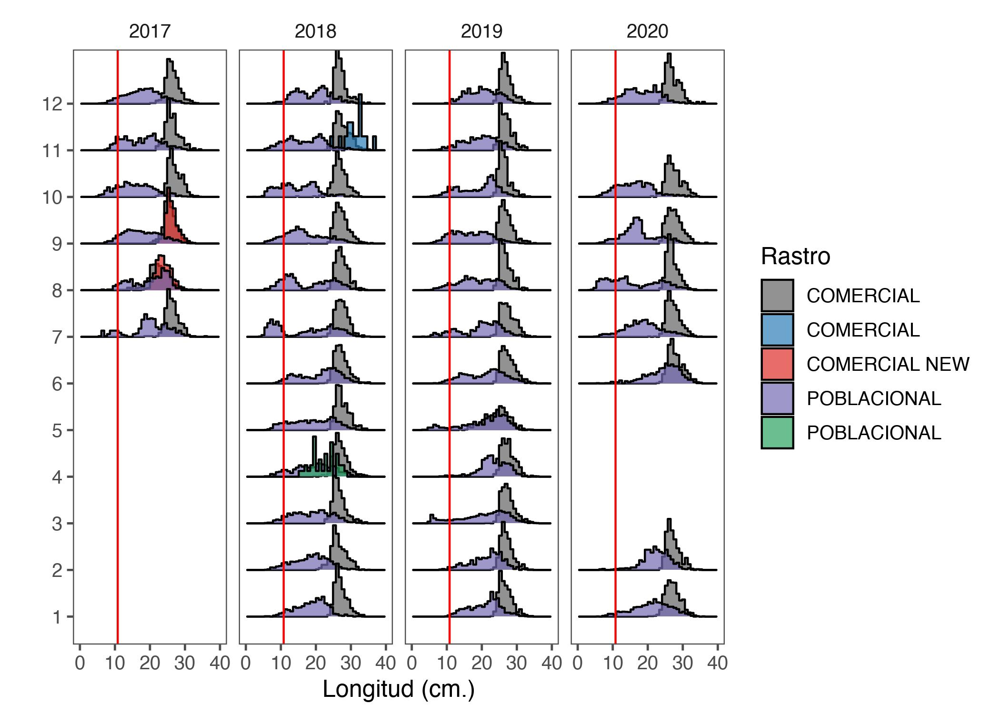
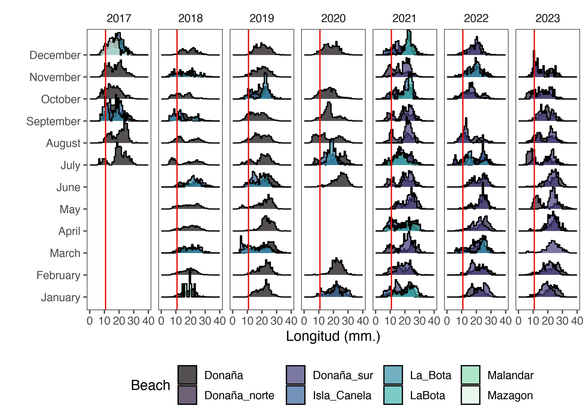
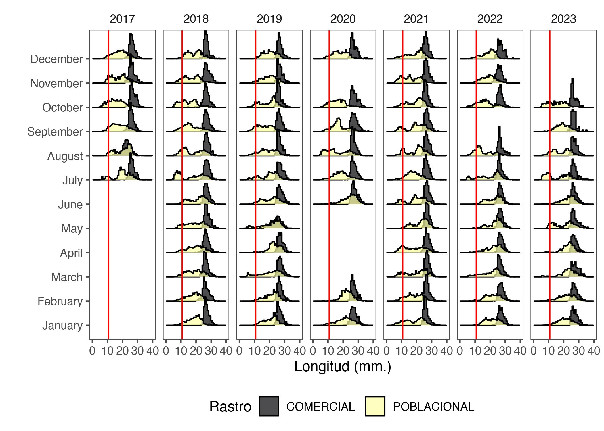

```r
rm(list = ls())
knitr::opts_chunk$set(echo = TRUE,
                      message = FALSE,
                      warning = FALSE,
                      fig.align = 'center',
                      dev = 'jpeg',
                      dpi = 300)
#XQuartz is a mess, put this in your onload to default to cairo instead
options(bitmapType = "cairo") 
# (https://github.com/tidyverse/ggplot2/issues/2655)
# Lo mapas se hacen mas rapido
```


```r
library(tidyverse)
library(ggridges)
library(readxl)
library(here)
library(lubridate)
library(readr)
library(ggthemes)
```

# Objective


The following document and code intends to carry out a complementary
methodological Exploratory Data Analysis from survey data in coquina (*Donux truculus*), in this case, with a biological component like lengths structure, density  indicator and fishery yield in CPUE type.


## Set path


```r
data <- here("~/IEO/DATA/Datos FEMP_AND_04/Coquina_Data")
```
# Length Frecuency Data Base


## Read Data Base


```r
size2017 <- read.csv("~/IEO/DATA/Datos FEMP_AND_04/Coquina_Data/Anterior a 2020/data_ieo_2017_def.csv", sep = ";")
size2018 <- read.csv("~/IEO/DATA/Datos FEMP_AND_04/Coquina_Data/Anterior a 2020/data_ieo_2018_def.csv", sep = ";")
size2019 <- read.csv("~/IEO/DATA/Datos FEMP_AND_04/Coquina_Data/Anterior a 2020/data_ieo_2019_def.csv", sep = ";")
size2020 <- read.csv("~/IEO/DATA/Datos FEMP_AND_04/Coquina_Data/Anterior a 2020/data_ieo_2020_def.csv", sep = ";")

size2021 <- read_excel("~/IEO/DATA/Datos FEMP_AND_04/Coquina_Data/Posterior 2020/Data_size_Coquina_2021.xlsx", sheet = "Coquina_donax")
size2022 <- read_excel("~/IEO/DATA/Datos FEMP_AND_04/Coquina_Data/Posterior 2020/Data_size_Coquina_2022.xlsx",  sheet = "Coquina_donax")
size2023 <- read_excel("~/IEO/DATA/Datos FEMP_AND_04/Coquina_Data/Posterior 2020/Data_size_Coquina_2023.xlsx",  sheet = "Coquina_Donax")
```

## Test dimension and names columns and diferences


```r
dim(size2017)
```

```
## [1] 10121    28
```

```r
dim(size2018)
```

```
## [1] 20418    28
```

```r
dim(size2019)       
```

```
## [1] 18109    28
```

```r
dim(size2020)
```

```
## [1] 13435    28
```

```r
dim(size2021)
```

```
## [1] 21971    12
```


```r
names(size2017)
```

```
##  [1] "months"                      "Date"                       
##  [3] "Beach"                       "Sampling.point"             
##  [5] "track_activelog"             "lat_1"                      
##  [7] "long_1"                      "lat_2"                      
##  [9] "long_2"                      "plus_m"                     
## [11] "tow_time"                    "rastro"                     
## [13] "zaranda"                     "mariscador"                 
## [15] "sample"                      "Sample_weight"              
## [17] "Clam_sample_weigth"          "Measured_clam_sample_weigth"
## [19] "CAT"                         "Categoria"                  
## [21] "Size"                        "SizeE"                      
## [23] "Tide_coef"                   "Low_tide_hour"              
## [25] "Sampling_hour"               "number_fisherman"           
## [27] "veda"                        "dists"
```

```r
names(size2018)
```

```
##  [1] "months"                      "Date"                       
##  [3] "Beach"                       "Sampling.point"             
##  [5] "track_activelog"             "lat_1"                      
##  [7] "long_1"                      "lat_2"                      
##  [9] "long_2"                      "plus_m"                     
## [11] "tow_time"                    "rastro"                     
## [13] "zaranda"                     "mariscador"                 
## [15] "sample"                      "Sample_weight"              
## [17] "Clam_sample_weigth"          "Measured_clam_sample_weigth"
## [19] "CAT"                         "Categoria"                  
## [21] "Size"                        "SizeE"                      
## [23] "Tide_coef"                   "Low_tide_hour"              
## [25] "Sampling_hour"               "number_fisherman"           
## [27] "veda"                        "dists"
```

```r
names(size2019)
```

```
##  [1] "months"                      "Date"                       
##  [3] "Beach"                       "Sampling.point"             
##  [5] "track_activelog"             "lat_1"                      
##  [7] "long_1"                      "lat_2"                      
##  [9] "long_2"                      "plus_m"                     
## [11] "tow_time"                    "rastro"                     
## [13] "zaranda"                     "mariscador"                 
## [15] "sample"                      "Sample_weight"              
## [17] "Clam_sample_weigth"          "Measured_clam_sample_weigth"
## [19] "CAT"                         "Categoria"                  
## [21] "Size"                        "SizeE"                      
## [23] "Tide_coef"                   "Low_tide_hour"              
## [25] "Sampling_hour"               "number_fisherman"           
## [27] "veda"                        "dists"
```

```r
names(size2020)
```

```
##  [1] "months"                      "Date"                       
##  [3] "Beach"                       "Sampling.point"             
##  [5] "track_activelog"             "lat_1"                      
##  [7] "long_1"                      "lat_2"                      
##  [9] "long_2"                      "plus_m"                     
## [11] "tow_time"                    "rastro"                     
## [13] "zaranda"                     "mariscador"                 
## [15] "sample"                      "Sample_weight"              
## [17] "Clam_sample_weigth"          "Measured_clam_sample_weigth"
## [19] "CAT"                         "Categoria"                  
## [21] "Size"                        "SizeE"                      
## [23] "Tide_coef"                   "Low_tide_hour"              
## [25] "Sampling_hour"               "number_fisherman"           
## [27] "veda"                        "dists"
```

```r
names(size2021)
```

```
##  [1] "species"                "Date"                   "Beach"                 
##  [4] "Sampling.point"         "rastro"                 "CAT"                   
##  [7] "Categoria"              "size"                   "sizeE"                 
## [10] "ID"                     "ID_codificado_punto"    "ID_codificado_muestreo"
```


Same names. Could merge the DF

```r
size_17_20 <- rbind(size2017,
                    size2018,
                    size2019,
                    size2020)
# new dimension
dim(size_17_20)
```

```
## [1] 62083    28
```

```r
names(size_17_20)
```

```
##  [1] "months"                      "Date"                       
##  [3] "Beach"                       "Sampling.point"             
##  [5] "track_activelog"             "lat_1"                      
##  [7] "long_1"                      "lat_2"                      
##  [9] "long_2"                      "plus_m"                     
## [11] "tow_time"                    "rastro"                     
## [13] "zaranda"                     "mariscador"                 
## [15] "sample"                      "Sample_weight"              
## [17] "Clam_sample_weigth"          "Measured_clam_sample_weigth"
## [19] "CAT"                         "Categoria"                  
## [21] "Size"                        "SizeE"                      
## [23] "Tide_coef"                   "Low_tide_hour"              
## [25] "Sampling_hour"               "number_fisherman"           
## [27] "veda"                        "dists"
```


```r
glimpse(size_17_20)
```

```
## Rows: 62,083
## Columns: 28
## $ months                      <int> 7, 7, 7, 7, 7, 7, 7, 7, 7, 7, 7, 7, 7, 7, …
## $ Date                        <chr> "13/07/2017", "13/07/2017", "13/07/2017", …
## $ Beach                       <chr> "Donana", "Donana", "Donana", "Donana", "D…
## $ Sampling.point              <chr> "2", "2", "2", "2", "2", "2", "2", "2", "2…
## $ track_activelog             <dbl> NA, NA, NA, NA, NA, NA, NA, NA, NA, NA, NA…
## $ lat_1                       <dbl> NA, NA, NA, NA, NA, NA, NA, NA, NA, NA, NA…
## $ long_1                      <dbl> NA, NA, NA, NA, NA, NA, NA, NA, NA, NA, NA…
## $ lat_2                       <dbl> NA, NA, NA, NA, NA, NA, NA, NA, NA, NA, NA…
## $ long_2                      <dbl> NA, NA, NA, NA, NA, NA, NA, NA, NA, NA, NA…
## $ plus_m                      <int> NA, NA, NA, NA, NA, NA, NA, NA, NA, NA, NA…
## $ tow_time                    <dbl> 5, 5, 5, 5, 5, 5, 5, 5, 5, 5, 5, 5, 5, 5, …
## $ rastro                      <chr> "COMERCIAL", "COMERCIAL", "COMERCIAL", "CO…
## $ zaranda                     <chr> "R", "R", "R", "R", "R", "R", "R", "R", "R…
## $ mariscador                  <chr> "LUIS", "LUIS", "LUIS", "LUIS", "LUIS", "L…
## $ sample                      <chr> "13/07/2017", "13/07/2017", "13/07/2017", …
## $ Sample_weight               <dbl> NA, NA, NA, NA, NA, NA, NA, NA, NA, NA, NA…
## $ Clam_sample_weigth          <dbl> 195, 195, 195, 195, 195, 195, 195, 195, 19…
## $ Measured_clam_sample_weigth <dbl> 195, 195, 195, 195, 195, 195, 195, 195, 19…
## $ CAT                         <int> 1, 1, 1, 1, 1, 1, 1, 1, 1, 1, 1, 1, 1, 1, …
## $ Categoria                   <chr> "", "", "", "", "", "", "", "", "", "", ""…
## $ Size                        <dbl> 27.21, 26.65, 26.65, 25.07, 27.49, 26.15, …
## $ SizeE                       <int> 27, 26, 26, 25, 27, 26, 26, 28, 25, 28, 26…
## $ Tide_coef                   <int> 72, 72, 72, 72, 72, 72, 72, 72, 72, 72, 72…
## $ Low_tide_hour               <chr> "12:30 AM", "12:30 AM", "12:30 AM", "12:30…
## $ Sampling_hour               <chr> "", "", "", "", "", "", "", "", "", "", ""…
## $ number_fisherman            <lgl> NA, NA, NA, NA, NA, NA, NA, NA, NA, NA, NA…
## $ veda                        <lgl> NA, NA, NA, NA, NA, NA, NA, NA, NA, NA, NA…
## $ dists                       <lgl> NA, NA, NA, NA, NA, NA, NA, NA, NA, NA, NA…
```
## Change `Date` columns from `character`to `Date` format


```r
size_17_20$Date <- dmy(size_17_20$Date)
# separo los meses , dias y años
# Separar en columnas de día, mes y año
realdate <- as.Date(size_17_20$Date, format="%Y-%M-%D")

dfdate <- data.frame(Date=realdate)
ANO=as.numeric (format(realdate,"%Y"))
MES=as.numeric (format(realdate,"%m"))
DIA=as.numeric (format(realdate,"%d"))

size2<-cbind(dfdate,ANO,MES,DIA,size_17_20)
colnames(size2)
```

```
##  [1] "Date"                        "ANO"                        
##  [3] "MES"                         "DIA"                        
##  [5] "months"                      "Date"                       
##  [7] "Beach"                       "Sampling.point"             
##  [9] "track_activelog"             "lat_1"                      
## [11] "long_1"                      "lat_2"                      
## [13] "long_2"                      "plus_m"                     
## [15] "tow_time"                    "rastro"                     
## [17] "zaranda"                     "mariscador"                 
## [19] "sample"                      "Sample_weight"              
## [21] "Clam_sample_weigth"          "Measured_clam_sample_weigth"
## [23] "CAT"                         "Categoria"                  
## [25] "Size"                        "SizeE"                      
## [27] "Tide_coef"                   "Low_tide_hour"              
## [29] "Sampling_hour"               "number_fisherman"           
## [31] "veda"                        "dists"
```

```r
table(size2$ANO)
```

```
## 
##  2017  2018  2019  2020 
## 10121 20418 18109 13435
```

Now we test.

```r
table(size2$ANO)
```

```
## 
##  2017  2018  2019  2020 
## 10121 20418 18109 13435
```
## Viz

first glimpse. Red line is SL50 (10.8 cm to female (Delgado & Silva, 2016)

```r
nreg <- ggplot(size2 %>% 
                 select(-1), 
               aes(x=Size, 
                   y = as.factor(MES),
                  fill= as.factor(rastro)))+
  geom_density_ridges(stat = "binline", 
                      bins = 50, 
                      scale = 1.2,
                      alpha=0.7)+
  facet_wrap(.~ANO, ncol=4) +
  geom_vline(xintercept = 10.8, color = "red")+
  scale_fill_manual(values = c("#636363", "#2c7fb8", "#de2d26", "#756bb1", "#2ca25f"),
                       name="Rastro")+
  theme(axis.text.x = element_text(angle = 90, hjust = 1))+
  theme_few()+
  xlab("Longitud (cm.)")+
  ylab("")+
  xlim(0,40)
#scale_x_discrete((limits = rev(levels(talla2021$ANO_ARR))))+
nreg
```


by beach


```r
nbeach <- ggplot(size2 %>% 
                 select(-1), 
               aes(x=Size, 
                   y = as.factor(MES),
                  fill= as.factor(Beach)))+
  geom_density_ridges(stat = "binline", 
                      bins = 50, 
                      scale = 1.2,
                      alpha=0.7)+
  facet_wrap(.~ANO, ncol=4) +
  geom_vline(xintercept = 10.8, color = "red")+
  scale_fill_viridis_d(option="F",
                       name="Beach")+
  theme(axis.text.x = element_text(angle = 90, hjust = 1))+
  theme_few()+
  xlab("Longitud (cm.)")+
  ylab("")+
  xlim(0,40)
#scale_x_discrete((limits = rev(levels(talla2021$ANO_ARR))))+
nbeach
```


Now, we handling data 2021-2023 


```r
size2021b <- size2021 %>% 
  select(2, 3, 4, 5, 6, 7, 8, 9, 12)
names(size2021b)
```

```
## [1] "Date"                   "Beach"                  "Sampling.point"        
## [4] "rastro"                 "CAT"                    "Categoria"             
## [7] "size"                   "sizeE"                  "ID_codificado_muestreo"
```

```r
size2022b <- size2022 %>% 
  select(-c(1, 2))
size2023b <- size2023 %>% 
  select(-c(1, 2))

size_21_23 <- rbind(size2021b,
                    size2022b,
                    size2023b)
```
## Separate `Date` column


```r
# separo los meses , dias y años
# Separar en columnas de día, mes y año
realdate2 <- as.Date(size_21_23$Date, format="%Y-%M-%D")

dfdate2 <- data.frame(Date=realdate2)
ANO=as.numeric (format(realdate2,"%Y"))
MES=as.numeric (format(realdate2,"%m"))
DIA=as.numeric (format(realdate2,"%d"))

size3<-cbind(dfdate2,ANO,MES,DIA,size_21_23)
colnames(size3)
```

```
##  [1] "Date"                   "ANO"                    "MES"                   
##  [4] "DIA"                    "Date"                   "Beach"                 
##  [7] "Sampling.point"         "rastro"                 "CAT"                   
## [10] "Categoria"              "size"                   "sizeE"                 
## [13] "ID_codificado_muestreo"
```

```r
table(size3$ANO)
```

```
## 
##  2021  2022  2023 
## 21971 17426  6751
```
Now join all years


```r
names(size2) # 2017-2020
```

```
##  [1] "Date"                        "ANO"                        
##  [3] "MES"                         "DIA"                        
##  [5] "months"                      "Date"                       
##  [7] "Beach"                       "Sampling.point"             
##  [9] "track_activelog"             "lat_1"                      
## [11] "long_1"                      "lat_2"                      
## [13] "long_2"                      "plus_m"                     
## [15] "tow_time"                    "rastro"                     
## [17] "zaranda"                     "mariscador"                 
## [19] "sample"                      "Sample_weight"              
## [21] "Clam_sample_weigth"          "Measured_clam_sample_weigth"
## [23] "CAT"                         "Categoria"                  
## [25] "Size"                        "SizeE"                      
## [27] "Tide_coef"                   "Low_tide_hour"              
## [29] "Sampling_hour"               "number_fisherman"           
## [31] "veda"                        "dists"
```

```r
names(size3)# 2021-2023
```

```
##  [1] "Date"                   "ANO"                    "MES"                   
##  [4] "DIA"                    "Date"                   "Beach"                 
##  [7] "Sampling.point"         "rastro"                 "CAT"                   
## [10] "Categoria"              "size"                   "sizeE"                 
## [13] "ID_codificado_muestreo"
```

```r
size2fil <- size2 %>% 
  select(1, 2, 3, 4, 7, 8, 16, 23, 24, 25, 26)
size3fil <- size3 %>% 
  select(-c(13,5)) %>% 
  rename(Size = size,
         SizeE = sizeE)

names(size2fil) # 2017-2020
```

```
##  [1] "Date"           "ANO"            "MES"            "DIA"           
##  [5] "Beach"          "Sampling.point" "rastro"         "CAT"           
##  [9] "Categoria"      "Size"           "SizeE"
```

```r
names(size3fil)# 2021-2023
```

```
##  [1] "Date"           "ANO"            "MES"            "DIA"           
##  [5] "Beach"          "Sampling.point" "rastro"         "CAT"           
##  [9] "Categoria"      "Size"           "SizeE"
```

```r
# join data

sizeall <- rbind(size2fil, size3fil)
```


check


```r
dim(sizeall)
```

```
## [1] 108231     11
```

```r
table(sizeall$ANO)
```

```
## 
##  2017  2018  2019  2020  2021  2022  2023 
## 10121 20418 18109 13435 21971 17426  6751
```


some plots


```r
nall <- ggplot(sizeall, 
               aes(x=Size, 
                   y = as.factor(MES),
                  fill= as.factor(rastro)))+
  geom_density_ridges(stat = "binline", 
                      bins = 50, 
                      scale = 1.2,
                      alpha=0.7)+
  facet_wrap(.~ANO, ncol=7) +
  geom_vline(xintercept = 10.8, color = "red")+
  scale_fill_viridis_d(option="B",
                       name="Rastro")+
  theme(axis.text.x = element_text(angle = 90, hjust = 1))+
  theme_few()+
  theme(legend.position = "bottom")+
  xlab("Longitud (cm.)")+
  ylab("")+
  xlim(0,40)
#scale_x_discrete((limits = rev(levels(talla2021$ANO_ARR))))+
nall
```




```r
nallbeach <- ggplot(sizeall, 
               aes(x=Size, 
                   y = as.factor(MES),
                  fill= as.factor(Beach)))+
  geom_density_ridges(stat = "binline", 
                      bins = 50, 
                      scale = 1.2,
                      alpha=0.7)+
  facet_wrap(.~ANO, ncol=7) +
  geom_vline(xintercept = 10.8, color = "red")+
  scale_fill_viridis_d(option="F",
                       name="Beach")+
  theme(axis.text.x = element_text(angle = 90, hjust = 1))+
  theme_few()+
  xlab("Longitud (cm.)")+
  ylab("")+
  xlim(0,40)
#scale_x_discrete((limits = rev(levels(talla2021$ANO_ARR))))+
nallbeach
```


just POBLACIONAL  sample


```r
pobeach <- ggplot(sizeall %>% 
                      filter(rastro!="COMERCIAL"), 
               aes(x=Size, 
                   y = as.factor(MES),
                  fill= as.factor(Beach)))+
  geom_density_ridges(stat = "binline", 
                      bins = 50, 
                      scale = 1.2,
                      alpha=0.7)+
  facet_wrap(.~ANO, ncol=7) +
  geom_vline(xintercept = 10.8, color = "red")+
  scale_fill_viridis_d(option="G",
                       name="Beach")+
  theme(axis.text.x = element_text(angle = 90, hjust = 1))+
  theme_few()+
  xlab("Longitud (cm.)")+
  ylab("")+
  xlim(0,40)
#scale_x_discrete((limits = rev(levels(talla2021$ANO_ARR))))+
pobeach
```


justm COMERCIAL sample


```r
combeach <- ggplot(sizeall %>% 
                      filter(rastro!="POBLACIONAL"), 
               aes(x=Size, 
                   y = as.factor(MES),
                  fill= as.factor(Beach)))+
  geom_density_ridges(stat = "binline", 
                      bins = 50, 
                      scale = 1.2,
                      alpha=0.7)+
  facet_wrap(.~ANO, ncol=7) +
  geom_vline(xintercept = 10.8, color = "red")+
  scale_fill_viridis_d(option="F",
                       name="Beach")+
  theme(axis.text.x = element_text(angle = 90, hjust = 1))+
  theme_few()+
  xlab("Longitud (cm.)")+
  ylab("")+
  xlim(0,40)
#scale_x_discrete((limits = rev(levels(talla2021$ANO_ARR))))+
combeach
```


# Density Data Base


```r
ggplot () + 
  aes (wt, mpg) +
  geom_point ()+
  geom_smooth () +
  stat_smooth(geom = "point",
            color = "blue",
            xseg = mtcars$wt)
```


# Yield
