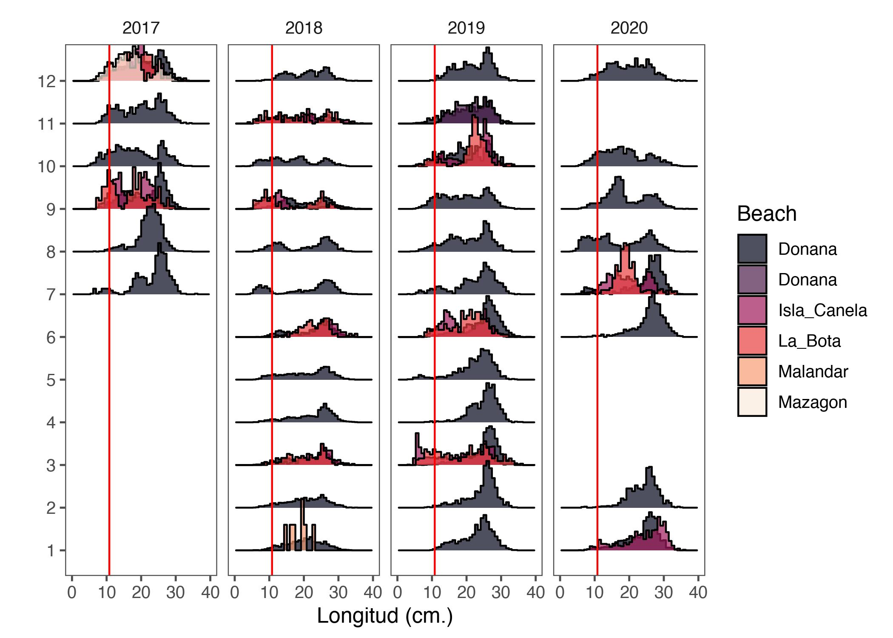
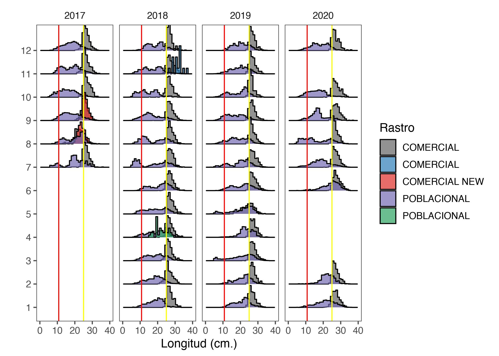
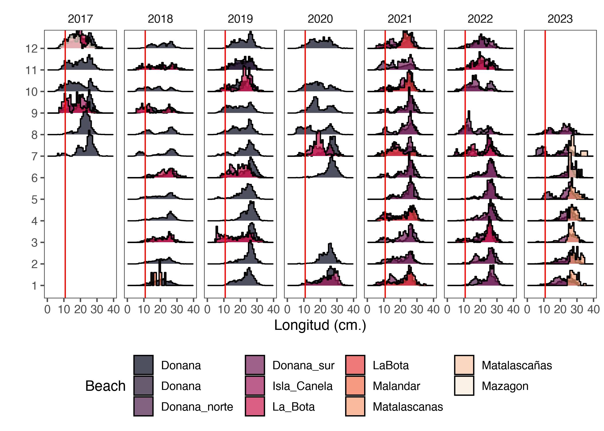
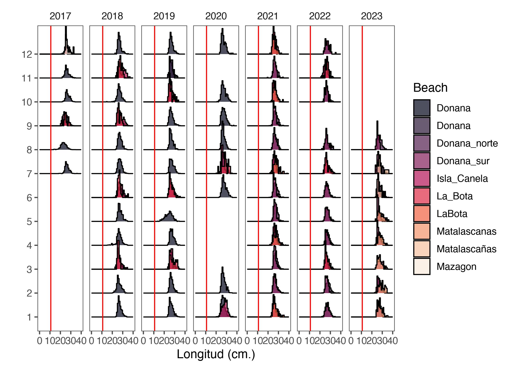
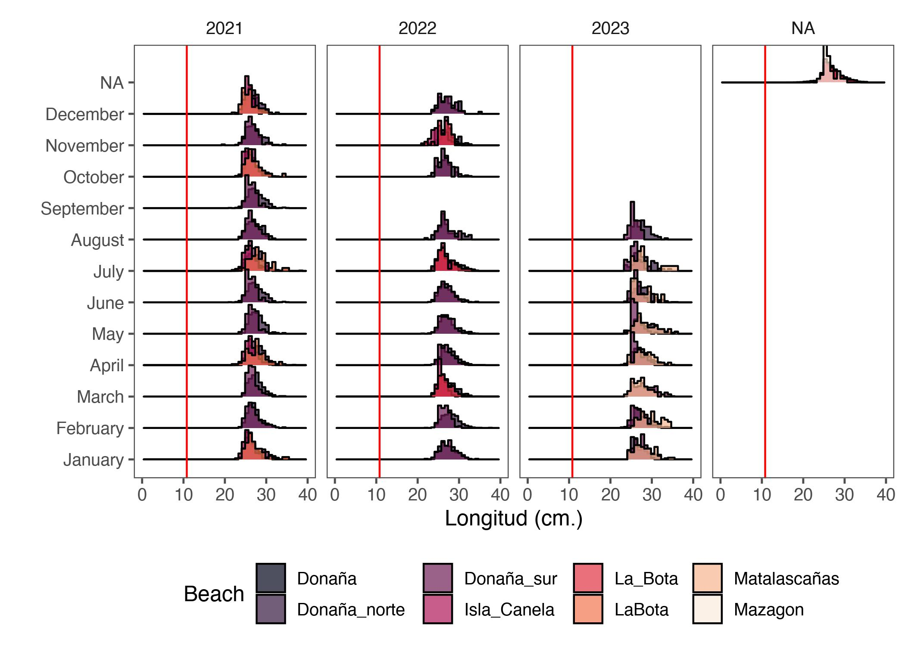
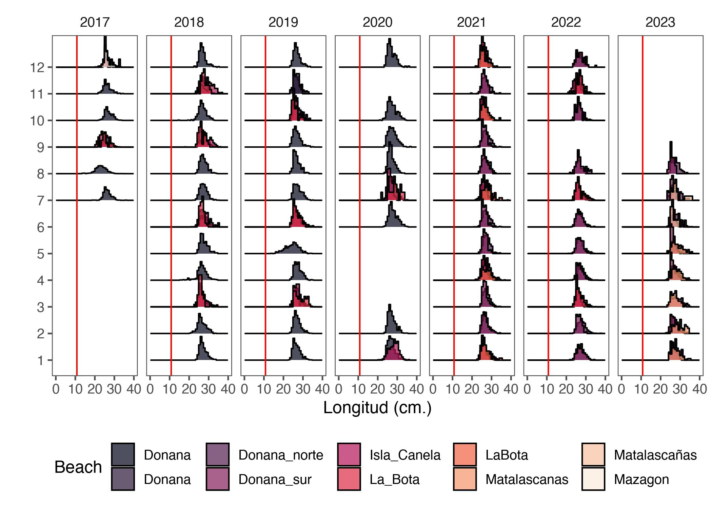
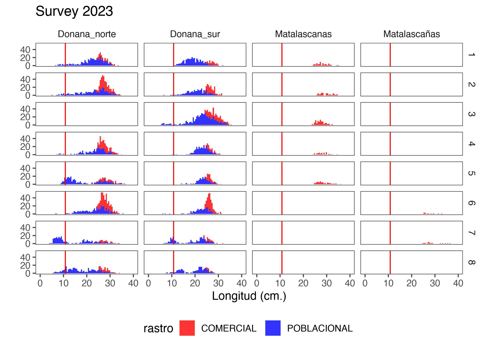

```r
rm(list = ls())
knitr::opts_chunk$set(echo = TRUE,
                      message = FALSE,
                      warning = FALSE,
                      fig.align = 'center',
                      dev = 'jpeg',
                      dpi = 300, 
                      fig.align='center')
#XQuartz is a mess, put this in your onload to default to cairo instead
options(bitmapType = "cairo") 
# (https://github.com/tidyverse/ggplot2/issues/2655)
# Lo mapas se hacen mas rapido
```


```r
library(tidyverse)
library(ggridges)
library(readxl)
library(here)
library(lubridate)
library(readr)
library(ggthemes)
```


# OBJECTIVO


The following document and code intends to carry out a complementary
methodological Exploratory Data Analysis from survey data in coquina (*Donux truculus*) in a historic context review of FEMP_AND_04 project.

In this case, we analysed biological component like lengths structure, density indicator and fishery yield in CPUE type.

This analysis are essential to give advice to Junta de Andaluacía through management plan to D. trunculus [@BOJA2023].

# AREA DE ESTUDIO

La zona de distribuci


Para la aplicación de la regulación marisquera, relacionado con la producción, el litoral andaluz se dividió en diferentes “zonas de producción” (ZZPP) las cuales se encuentran definidas en la Orden de 15 de julio de 1993 (BOJA nº 85 de 5/8/1993)- En esta Orden se declaran las zonas de producción y protección o mejora de moluscos bivalvos, moluscos gasterópodos, tunicados y equinodermos marinos de la Comunidad Autónoma de Andalucía, fuera de las cuales quedará prohibida la su recolección. Esta norma delimita zonas de producción de moluscos bivalvos a lo largo del litoral andaluz en los cuales se encuentran los puntos de muestreo establecidos en el seguimiento temporal de *D. trunculus* en el litoral de Huelva llevado a cabo por el IEO  (Figura \@ref(fig:map1)).


<div class="figure" style="text-align: center">

<p class="caption">(\#fig:map1)Mapa con los puntos de muestreo establecidos en el seguimiento temporal de D. trunculus en el litoral de Huelva llevado a cabo por el IEO.</p>
</div>

# ENFOQUE DE AED

These data, spetially length frecuencies, must be weighted to the sampling estimates, because they are just a subsample. This approach has a logic used to `POBLACIONAL` (Figura \@ref(fig:edaplot1)) and `COMERCIAL` samples (Figura \@ref(fig:edaplot2));

<div class="figure" style="text-align: center">

<p class="caption">(\#fig:edaplot1)Poblacional sample scheme</p>
</div>

<div class="figure" style="text-align: center">

<p class="caption">(\#fig:edaplot2)Comercial sample scheme</p>
</div>
En este codigo autocontenido, analizaremos tres componentes de interés. Estructuras de tallas, densidades poblacionales e Indice de reclutamiento.

# BASES DATOS

## Leer y juntar Data Base

### Bases de Longitudes


```r
# Datos 2020 size and dens and abundance join
size2017 <- read.csv2(here("Data", "Anterior a 2020", "data_ieo_2017_def.csv"), dec=".")
size2018 <- read.csv2(here("Data", "Anterior a 2020", "data_ieo_2018_def.csv"), dec=".")
size2019 <- read.csv2(here("Data", "Anterior a 2020", "data_ieo_2019_def.csv"), dec=".")
size2020 <- read.csv2(here("Data", "Anterior a 2020", "data_ieo_2020_def.csv"), dec=".")

# datos post 2020 separate files sizes and dens

# Lenght 
size2021 <- read_excel(here("Data", "Posterior 2020", "Data_size_Coquina_2021.xlsx"), 
                       sheet = "Coquina_donax")
size2022 <- read_excel(here("Data", "Posterior 2020", "Data_size_Coquina_2022.xlsx"),  
                       sheet = "Coquina_donax")
size2023 <- read_excel(here("Data", "Posterior 2020", "Data_size_Coquina_2023.xlsx"),  
                       sheet = "Coquina_Donax")
```

### Bases de Densidades

Se deben leer las dos hojas `POBLACIONAL` y `COMERCIAL` por separado y luego unir. 

Recordar wque las bases de densidades previas al 2020 estan en la misma base que las longitudes


```r
dens2021pob <- read_excel(here("Data", "Posterior 2020", "Data_sample_FEMP_04_2021.xlsx"),
                       sheet = "Data_POBL")
dens2021com <- read_excel(here("Data", "Posterior 2020", "Data_sample_FEMP_04_2021.xlsx"),
                       sheet = "DATA_COM")

dens2022pob <- read_excel(here("Data", "Posterior 2020", "Data_sample_FEMP_04_2022.xlsx"),
                       sheet = "Data_POBL")
dens2022com <- read_excel(here("Data", "Posterior 2020", "Data_sample_FEMP_04_2022.xlsx"),
                       sheet = "DATA_COM")

dens2023pob <- read_excel(here("Data", "Posterior 2020", "Data_sample_FEMP_04_2023.xlsx"),
                       sheet = "Data_POBL")
dens2023com <- read_excel(here("Data", "Posterior 2020", "Data_sample_FEMP_04_2023.xlsx"),
                       sheet = "DATA_COM")

head(dens2023pob)
```

```
## # A tibble: 6 × 44
##   Month Date                Beach     Sampl…¹ m_track tow_t…²  Latº Latmin Longº
##   <dbl> <dttm>              <chr>       <dbl>   <dbl>   <dbl> <dbl>  <dbl> <dbl>
## 1     1 2023-01-24 00:00:00 Donana_n…       6      52       5    36   56.8     6
## 2     1 2023-01-24 00:00:00 Donana_n…       6      52       5    36   56.8     6
## 3     1 2023-01-24 00:00:00 Donana_n…       4      57       5    36   53.4     6
## 4     1 2023-01-24 00:00:00 Donana_n…       4      57       5    36   53.4     6
## 5     1 2023-01-24 00:00:00 Donana_s…       2      61       5    36   50.2     6
## 6     1 2023-01-24 00:00:00 Donana_s…       2      61       5    36   50.2     6
## # … with 35 more variables: Longmin <dbl>, Lat <lgl>, Long <lgl>, rastro <chr>,
## #   mariscador <chr>, SW <dbl>, SWsub <dbl>, CSWsub <dbl>, MCSWsub <dbl>,
## #   fps <dbl>, CSW <dbl>, fpm <dbl>, MCSW <dbl>, DCSWsub <dbl>, DCSW <dbl>,
## #   TCSW <dbl>, Btotal <dbl>, Categoria <chr>, CAT <dbl>, Nmedida <dbl>,
## #   fpn <dbl>, NtotalCSW <dbl>, Ndañossub <dbl>, Ndaños <dbl>, Ntotal <dbl>,
## #   Tide_coef <dbl>, Low_tide_hour <dttm>, Catch_hour <dttm>, species <chr>,
## #   Temp <lgl>, area <dbl>, bio <dbl>, dens <dbl>, ID <chr>, …
```

```r
names(dens2021com)
```

```
##  [1] "month"                  "Date"                   "Beach"                 
##  [4] "Sampling.point"         "m_track"                "tow_time"              
##  [7] "Latº"                   "Latmin"                 "Longº"                 
## [10] "Longmin"                "Lat"                    "Long"                  
## [13] "rastro"                 "mariscador"             "SW"                    
## [16] "SWsub"                  "CSWsub"                 "CMSWsub"               
## [19] "MCSWsub"                "fps"                    "CSW"                   
## [22] "CMSW"                   "MCSW"                   "DCSWsub"               
## [25] "DCSW"                   "TCSW"                   "Rend"                  
## [28] "Categoria"              "CAT"                    "Nmedida"               
## [31] "fpn"                    "NtotalCSW"              "Ndañossub"             
## [34] "Ndaños"                 "Ntotal"                 "Tide_coef"             
## [37] "Low_tide_hour"          "Catch_hour"             "species"               
## [40] "Temp"                   "ID"                     "ID_codificado_punto"   
## [43] "ID_codificado_muestreo"
```
# COMPOSICIONES DE TALLAS

Este aspecto se trabaja de forma de ponderación ad-hoc descrita en la Figure \@ref(fig:edaplot1)


## Test dimension and names columns and diferences


```r
dim(size2017)
```

```
## [1] 10121    28
```

```r
dim(size2018)
```

```
## [1] 20418    28
```

```r
dim(size2019)       
```

```
## [1] 18109    28
```

```r
dim(size2020)
```

```
## [1] 13435    28
```

```r
dim(size2021)
```

```
## [1] 21971    12
```


```r
names(size2017)
```

```
##  [1] "months"                      "Date"                       
##  [3] "Beach"                       "Sampling.point"             
##  [5] "track_activelog"             "lat_1"                      
##  [7] "long_1"                      "lat_2"                      
##  [9] "long_2"                      "plus_m"                     
## [11] "tow_time"                    "rastro"                     
## [13] "zaranda"                     "mariscador"                 
## [15] "sample"                      "Sample_weight"              
## [17] "Clam_sample_weigth"          "Measured_clam_sample_weigth"
## [19] "CAT"                         "Categoria"                  
## [21] "Size"                        "SizeE"                      
## [23] "Tide_coef"                   "Low_tide_hour"              
## [25] "Sampling_hour"               "number_fisherman"           
## [27] "veda"                        "dists"
```

```r
names(size2018)
```

```
##  [1] "months"                      "Date"                       
##  [3] "Beach"                       "Sampling.point"             
##  [5] "track_activelog"             "lat_1"                      
##  [7] "long_1"                      "lat_2"                      
##  [9] "long_2"                      "plus_m"                     
## [11] "tow_time"                    "rastro"                     
## [13] "zaranda"                     "mariscador"                 
## [15] "sample"                      "Sample_weight"              
## [17] "Clam_sample_weigth"          "Measured_clam_sample_weigth"
## [19] "CAT"                         "Categoria"                  
## [21] "Size"                        "SizeE"                      
## [23] "Tide_coef"                   "Low_tide_hour"              
## [25] "Sampling_hour"               "number_fisherman"           
## [27] "veda"                        "dists"
```

```r
names(size2019)
```

```
##  [1] "months"                      "Date"                       
##  [3] "Beach"                       "Sampling.point"             
##  [5] "track_activelog"             "lat_1"                      
##  [7] "long_1"                      "lat_2"                      
##  [9] "long_2"                      "plus_m"                     
## [11] "tow_time"                    "rastro"                     
## [13] "zaranda"                     "mariscador"                 
## [15] "sample"                      "Sample_weight"              
## [17] "Clam_sample_weigth"          "Measured_clam_sample_weigth"
## [19] "CAT"                         "Categoria"                  
## [21] "Size"                        "SizeE"                      
## [23] "Tide_coef"                   "Low_tide_hour"              
## [25] "Sampling_hour"               "number_fisherman"           
## [27] "veda"                        "dists"
```

```r
names(size2020)
```

```
##  [1] "months"                      "Date"                       
##  [3] "Beach"                       "Sampling.point"             
##  [5] "track_activelog"             "lat_1"                      
##  [7] "long_1"                      "lat_2"                      
##  [9] "long_2"                      "plus_m"                     
## [11] "tow_time"                    "rastro"                     
## [13] "zaranda"                     "mariscador"                 
## [15] "sample"                      "Sample_weight"              
## [17] "Clam_sample_weigth"          "Measured_clam_sample_weigth"
## [19] "CAT"                         "Categoria"                  
## [21] "Size"                        "SizeE"                      
## [23] "Tide_coef"                   "Low_tide_hour"              
## [25] "Sampling_hour"               "number_fisherman"           
## [27] "veda"                        "dists"
```

```r
names(size2021)
```

```
##  [1] "species"                "Date"                   "Beach"                 
##  [4] "Sampling.point"         "rastro"                 "CAT"                   
##  [7] "Categoria"              "size"                   "sizeE"                 
## [10] "ID"                     "ID_codificado_punto"    "ID_codificado_muestreo"
```


Same names. Could merge the DF

```r
size_17_20 <- rbind(size2017,
                    size2018,
                    size2019,
                    size2020)
# new dimension
dim(size_17_20)
```

```
## [1] 62083    28
```

```r
names(size_17_20)
```

```
##  [1] "months"                      "Date"                       
##  [3] "Beach"                       "Sampling.point"             
##  [5] "track_activelog"             "lat_1"                      
##  [7] "long_1"                      "lat_2"                      
##  [9] "long_2"                      "plus_m"                     
## [11] "tow_time"                    "rastro"                     
## [13] "zaranda"                     "mariscador"                 
## [15] "sample"                      "Sample_weight"              
## [17] "Clam_sample_weigth"          "Measured_clam_sample_weigth"
## [19] "CAT"                         "Categoria"                  
## [21] "Size"                        "SizeE"                      
## [23] "Tide_coef"                   "Low_tide_hour"              
## [25] "Sampling_hour"               "number_fisherman"           
## [27] "veda"                        "dists"
```


```r
glimpse(size_17_20)
```

```
## Rows: 62,083
## Columns: 28
## $ months                      <int> 7, 7, 7, 7, 7, 7, 7, 7, 7, 7, 7, 7, 7, 7, …
## $ Date                        <chr> "13/07/2017", "13/07/2017", "13/07/2017", …
## $ Beach                       <chr> "Donana", "Donana", "Donana", "Donana", "D…
## $ Sampling.point              <chr> "2", "2", "2", "2", "2", "2", "2", "2", "2…
## $ track_activelog             <dbl> NA, NA, NA, NA, NA, NA, NA, NA, NA, NA, NA…
## $ lat_1                       <dbl> NA, NA, NA, NA, NA, NA, NA, NA, NA, NA, NA…
## $ long_1                      <dbl> NA, NA, NA, NA, NA, NA, NA, NA, NA, NA, NA…
## $ lat_2                       <dbl> NA, NA, NA, NA, NA, NA, NA, NA, NA, NA, NA…
## $ long_2                      <dbl> NA, NA, NA, NA, NA, NA, NA, NA, NA, NA, NA…
## $ plus_m                      <int> NA, NA, NA, NA, NA, NA, NA, NA, NA, NA, NA…
## $ tow_time                    <dbl> 5, 5, 5, 5, 5, 5, 5, 5, 5, 5, 5, 5, 5, 5, …
## $ rastro                      <chr> "COMERCIAL", "COMERCIAL", "COMERCIAL", "CO…
## $ zaranda                     <chr> "R", "R", "R", "R", "R", "R", "R", "R", "R…
## $ mariscador                  <chr> "LUIS", "LUIS", "LUIS", "LUIS", "LUIS", "L…
## $ sample                      <chr> "13/07/2017", "13/07/2017", "13/07/2017", …
## $ Sample_weight               <dbl> NA, NA, NA, NA, NA, NA, NA, NA, NA, NA, NA…
## $ Clam_sample_weigth          <dbl> 195, 195, 195, 195, 195, 195, 195, 195, 19…
## $ Measured_clam_sample_weigth <dbl> 195, 195, 195, 195, 195, 195, 195, 195, 19…
## $ CAT                         <int> 1, 1, 1, 1, 1, 1, 1, 1, 1, 1, 1, 1, 1, 1, …
## $ Categoria                   <chr> "", "", "", "", "", "", "", "", "", "", ""…
## $ Size                        <dbl> 27.21, 26.65, 26.65, 25.07, 27.49, 26.15, …
## $ SizeE                       <int> 27, 26, 26, 25, 27, 26, 26, 28, 25, 28, 26…
## $ Tide_coef                   <int> 72, 72, 72, 72, 72, 72, 72, 72, 72, 72, 72…
## $ Low_tide_hour               <chr> "12:30 AM", "12:30 AM", "12:30 AM", "12:30…
## $ Sampling_hour               <chr> "", "", "", "", "", "", "", "", "", "", ""…
## $ number_fisherman            <lgl> NA, NA, NA, NA, NA, NA, NA, NA, NA, NA, NA…
## $ veda                        <lgl> NA, NA, NA, NA, NA, NA, NA, NA, NA, NA, NA…
## $ dists                       <lgl> NA, NA, NA, NA, NA, NA, NA, NA, NA, NA, NA…
```
## Change `Date` columns from `character`to `Date` format


```r
size_17_20$Date <- dmy(size_17_20$Date)
# separo los meses , dias y años
# Separar en columnas de día, mes y año
realdate <- as.Date(size_17_20$Date, format="%Y-%M-%D")

dfdate <- data.frame(Date=realdate)
ANO=as.numeric (format(realdate,"%Y"))
MES=as.numeric (format(realdate,"%m"))
DIA=as.numeric (format(realdate,"%d"))

size2<-cbind(dfdate,ANO,MES,DIA,size_17_20)
colnames(size2)
```

```
##  [1] "Date"                        "ANO"                        
##  [3] "MES"                         "DIA"                        
##  [5] "months"                      "Date"                       
##  [7] "Beach"                       "Sampling.point"             
##  [9] "track_activelog"             "lat_1"                      
## [11] "long_1"                      "lat_2"                      
## [13] "long_2"                      "plus_m"                     
## [15] "tow_time"                    "rastro"                     
## [17] "zaranda"                     "mariscador"                 
## [19] "sample"                      "Sample_weight"              
## [21] "Clam_sample_weigth"          "Measured_clam_sample_weigth"
## [23] "CAT"                         "Categoria"                  
## [25] "Size"                        "SizeE"                      
## [27] "Tide_coef"                   "Low_tide_hour"              
## [29] "Sampling_hour"               "number_fisherman"           
## [31] "veda"                        "dists"
```

```r
table(size2$ANO)
```

```
## 
##  2017  2018  2019  2020 
## 10121 20418 18109 13435
```

Now we test.

```r
table(size2$ANO)
```

```
## 
##  2017  2018  2019  2020 
## 10121 20418 18109 13435
```


## Viz

first glimpse. Red line is SL50 (10.8 cm to female (Delgado & Silva, 2016)

```r
nreg <- ggplot(size2 %>% 
                 select(-1), 
               aes(x=Size, 
                   y = as.factor(MES),
                  fill= as.factor(rastro)))+
  geom_density_ridges(stat = "binline", 
                      bins = 40, 
                      scale = 1.2,
                      alpha=0.7)+
  facet_wrap(.~ANO, ncol=4) +
  geom_vline(xintercept = 10.8, color = "red")+
  scale_fill_manual(values = c("#636363", "#2c7fb8", "#de2d26", "#756bb1", "#2ca25f"),
                       name="Rastro")+
  theme(axis.text.x = element_text(angle = 90, hjust = 1))+
  theme_few()+
  xlab("Longitud (cm.)")+
  ylab("")+
  xlim(0,40)
#scale_x_discrete((limits = rev(levels(talla2021$ANO_ARR))))+
nreg
```


by beach


```r
nbeach <- ggplot(size2 %>% 
                 select(-1), 
               aes(x=SizeE, 
                   y = as.factor(MES),
                  fill= as.factor(Beach)))+
  geom_density_ridges(stat = "binline", 
                      bins = 40, 
                      scale = 1.2,
                      alpha=0.7)+
  facet_wrap(.~ANO, ncol=4) +
  geom_vline(xintercept = 10.8, color = "red")+
  scale_fill_viridis_d(option="F",
                       name="Beach")+
  theme(axis.text.x = element_text(angle = 90, hjust = 1))+
  theme_few()+
  xlab("Longitud (cm.)")+
  ylab("")+
  xlim(0,40)
#scale_x_discrete((limits = rev(levels(talla2021$ANO_ARR))))+
nbeach
```


Now, we handling data 2021-2023. Same columns data 2017-2020


```r
size2021b <- size2021 %>% 
  select(2, 3, 4, 5, 6, 7, 8, 9, 12)
names(size2021b)
```

```
## [1] "Date"                   "Beach"                  "Sampling.point"        
## [4] "rastro"                 "CAT"                    "Categoria"             
## [7] "size"                   "sizeE"                  "ID_codificado_muestreo"
```

```r
size2022b <- size2022 %>% 
  select(-c(1, 2))
size2023b <- size2023 %>% 
  select(-c(1, 2))

size_21_23 <- rbind(size2021b,
                    size2022b,
                    size2023b)
```
## Separate `Date` column


```r
# separo los meses , dias y años
# Separar en columnas de día, mes y año
realdate2 <- as.Date(size_21_23$Date, format="%Y-%M-%D")

dfdate2 <- data.frame(Date=realdate2)
ANO=as.numeric (format(realdate2,"%Y"))
MES=as.numeric (format(realdate2,"%m"))
DIA=as.numeric (format(realdate2,"%d"))

size3<-cbind(dfdate2,ANO,MES,DIA,size_21_23)
colnames(size3)
```

```
##  [1] "Date"                   "ANO"                    "MES"                   
##  [4] "DIA"                    "Date"                   "Beach"                 
##  [7] "Sampling.point"         "rastro"                 "CAT"                   
## [10] "Categoria"              "size"                   "sizeE"                 
## [13] "ID_codificado_muestreo"
```

```r
table(size3$ANO)
```

```
## 
##  2021  2022  2023 
## 21971 17426  6751
```
Now join all years


```r
names(size2) # 2017-2020
```

```
##  [1] "Date"                        "ANO"                        
##  [3] "MES"                         "DIA"                        
##  [5] "months"                      "Date"                       
##  [7] "Beach"                       "Sampling.point"             
##  [9] "track_activelog"             "lat_1"                      
## [11] "long_1"                      "lat_2"                      
## [13] "long_2"                      "plus_m"                     
## [15] "tow_time"                    "rastro"                     
## [17] "zaranda"                     "mariscador"                 
## [19] "sample"                      "Sample_weight"              
## [21] "Clam_sample_weigth"          "Measured_clam_sample_weigth"
## [23] "CAT"                         "Categoria"                  
## [25] "Size"                        "SizeE"                      
## [27] "Tide_coef"                   "Low_tide_hour"              
## [29] "Sampling_hour"               "number_fisherman"           
## [31] "veda"                        "dists"
```

```r
names(size3)# 2021-2023
```

```
##  [1] "Date"                   "ANO"                    "MES"                   
##  [4] "DIA"                    "Date"                   "Beach"                 
##  [7] "Sampling.point"         "rastro"                 "CAT"                   
## [10] "Categoria"              "size"                   "sizeE"                 
## [13] "ID_codificado_muestreo"
```

```r
size2fil <- size2 %>% 
  select(1, 2, 3, 4, 7, 8, 16, 23, 24, 25, 26)
size3fil <- size3 %>% 
  select(-c(13,5)) %>% 
  rename(Size = size,
         SizeE = sizeE)

names(size2fil) # 2017-2020
```

```
##  [1] "Date"           "ANO"            "MES"            "DIA"           
##  [5] "Beach"          "Sampling.point" "rastro"         "CAT"           
##  [9] "Categoria"      "Size"           "SizeE"
```

```r
names(size3fil)# 2021-2023
```

```
##  [1] "Date"           "ANO"            "MES"            "DIA"           
##  [5] "Beach"          "Sampling.point" "rastro"         "CAT"           
##  [9] "Categoria"      "Size"           "SizeE"
```

```r
# join data

sizeall <- rbind(size2fil, size3fil)
```


check


```r
dim(sizeall)
```

```
## [1] 108231     11
```

```r
table(sizeall$ANO)
```

```
## 
##  2017  2018  2019  2020  2021  2022  2023 
## 10121 20418 18109 13435 21971 17426  6751
```

Rename values


```r
sizeall2 <- sizeall %>% 
  mutate(rastro = str_replace_all(rastro, " ", ""))
unique(sizeall2$rastro)
```

```
## [1] "COMERCIAL"    "POBLACIONAL"  "COMERCIALNEW"
```

some plots


```r
nall <- ggplot(sizeall2, 
               aes(x=Size, 
                   y = as.factor(MES),
                  fill= as.factor(rastro)))+
  geom_density_ridges(stat = "binline", 
                      bins = 50, 
                      scale = 1.2,
                      alpha=0.7)+
  facet_wrap(.~ANO, ncol=7) +
  geom_vline(xintercept = 10.8, color = "red")+
  scale_fill_viridis_d(option="B",
                       name="Rastro")+
  theme(axis.text.x = element_text(angle = 90, hjust = 1))+
  theme_few()+
  theme(legend.position = "bottom")+
  xlab("Longitud (cm.)")+
  ylab("")+
  xlim(0,40)
#scale_x_discrete((limits = rev(levels(talla2021$ANO_ARR))))+
nall
```




```r
nallbeach <- ggplot(sizeall2, 
               aes(x=Size, 
                   y = as.factor(MES),
                  fill= as.factor(Beach)))+
  geom_density_ridges(stat = "binline", 
                      bins = 50, 
                      scale = 1.2,
                      alpha=0.7)+
  facet_wrap(.~ANO, ncol=7) +
  geom_vline(xintercept = 10.8, color = "red")+
  scale_fill_viridis_d(option="F",
                       name="Beach")+
  theme(axis.text.x = element_text(angle = 90, hjust = 1))+
  theme_few()+
  theme(legend.position = "bottom")+
  xlab("Longitud (cm.)")+
  ylab("")+
  xlim(0,40)
#scale_x_discrete((limits = rev(levels(talla2021$ANO_ARR))))+
nallbeach
```


just POBLACIONAL  sample


```r
pobeach <- ggplot(sizeall2 %>% 
                      filter(rastro!="COMERCIAL"), 
               aes(x=Size, 
                   y = as.factor(MES),
                  fill= as.factor(Beach)))+
  geom_density_ridges(stat = "binline", 
                      bins = 50, 
                      scale = 1.2,
                      alpha=0.7)+
  facet_wrap(.~ANO, ncol=7) +
  geom_vline(xintercept = 10.8, color = "red")+
  scale_fill_viridis_d(option="G",
                       name="Beach")+
  theme(axis.text.x = element_text(angle = 90, hjust = 1))+
  theme_few()+
  theme(legend.position = "bottom")+
  xlab("Longitud (cm.)")+
  ylab("")+
  xlim(0,40)
#scale_x_discrete((limits = rev(levels(talla2021$ANO_ARR))))+
pobeach
```


justm COMERCIAL sample


```r
combeach <- ggplot(sizeall %>% 
                      filter(rastro!="POBLACIONAL"), 
               aes(x=Size, 
                   y = as.factor(MES),
                  fill= as.factor(Beach)))+
  geom_density_ridges(stat = "binline", 
                      bins = 50, 
                      scale = 1.2,
                      alpha=0.7)+
  facet_wrap(.~ANO, ncol=7) +
  geom_vline(xintercept = 10.8, color = "red")+
  scale_fill_viridis_d(option="F",
                       name="Beach")+
  theme(axis.text.x = element_text(angle = 90, hjust = 1))+
  theme_few()+
  theme(legend.position = "bottom")+
  xlab("Longitud (cm.)")+
  ylab("")+
  xlim(0,40)
#scale_x_discrete((limits = rev(levels(talla2021$ANO_ARR))))+
combeach
```


last month of 2023 (august) by beach 


```r
combeachago23 <- ggplot(sizeall2 %>% 
                      filter(ANO==2023), 
               aes(x=Size, fill=rastro))+
  geom_histogram(bins = 80,
                      alpha=0.8)+
  scale_fill_manual(values = c("red", "blue"))+
  facet_grid(MES~Beach) +
  geom_vline(xintercept = 10.8, color = "red")+
  theme_few()+
  theme(legend.position = "bottom")+
  xlab("Longitud (cm.)")+
  ylab("")+
  xlim(0,40)+
  labs(title= "Survey 2023")
#scale_x_discrete((limits = rev(levels(talla2021$ANO_ARR))))+
combeachago23
```


another way to viz is 

scatter plot


```r
sizemean <-sizeall2 %>% 
  dplyr::group_by(ANO, MES, rastro, Beach) %>%
  dplyr::summarise(avg=mean(SizeE))
#kableExtra::kable(coutlength, format = "html")
```

Mean length in time series by Subarea.


```r
pmea <- ggplot(sizemean, 
               aes(MES,avg,
               color = factor(Beach)))+
    geom_point(show.legend = T,
               alpha=.7) +
    geom_smooth(method= "lm", 
                colour='#253494')+
    theme_few()+ 
    facet_grid(rastro~ANO)+
    scale_x_continuous(breaks = seq(from = 1, to = 12, by = 3))+
    #scale_y_discrete(breaks = seq(from = 1, to = 13, by = 1))+
    theme(axis.text.x = element_text(angle = 90))+
    guides(fill = guide_legend(reverse=F))+
    scale_color_viridis_d(option="H",
                          name="Beach")+
    ylim(15,30)+
    ylab("") +
    xlab("") +
    ggtitle("Lenght Mean Krill fishery")
pmea
```



Calculate a recruit index

## Calculate Index Recruit


```r
inderec <- sizeall %>% 
  filter(rastro=="POBLACIONAL") %>% 
  drop_na(Size) %>% 
  dplyr::group_by(ANO, MES) %>% 
  dplyr::mutate(prolen = Size - 10) %>% 
  dplyr::mutate(prolen2 = prolen*-1 ) %>% 
  dplyr::summarize(prolen3 =mean(prolen2))


limite_superior <- round(mean(inderec$prolen3) + 
  1.96 * sd(inderec$prolen3) / sqrt(inderec$prolen3),3)
limite_inferior <- round(mean(inderec$prolen3) - 
  1.96 * sd(inderec$prolen3) / sqrt(inderec$prolen3),3)
```


```r
inderec$colour <- ifelse(inderec$prolen3 < 0, "negative","positive")

indexplot <- ggplot(inderec,
                    aes(rev(MES),prolen3))+
  geom_bar(stat="identity",
           position="identity",
           aes(fill = colour))+
  scale_fill_manual(values=c(positive="firebrick1",
                             negative="black"),
                    name="")+
  facet_wrap(.~ANO)+
  theme_few()+
  scale_x_continuous(breaks = seq(from = 1, 
                                to = 12, by = 4))+
  labs(y="IRK",
       x="",
       title = "Index Recruit Krill 48.1")+
  coord_flip()
indexplot
```


# Quesstions 

## LFD DB

- What is `CAT`
- Difference between `size` and `sizeE`
- what variable we can see binside `MES`?
- data about maturity and reproductive indicator?
- Waypoint by beach?.
- How calculate recruit index and another way.
- Weigthing LF sensu MD.


# DENSITY DB


```r
ggplot () + 
  aes (wt, mpg) +
  geom_point ()+
  geom_smooth () +
  stat_smooth(geom = "point",
            color = "blue",
            xseg = mtcars$wt)
```


# YIELD (CPUE) ANALYSIS


# REFERENCES
